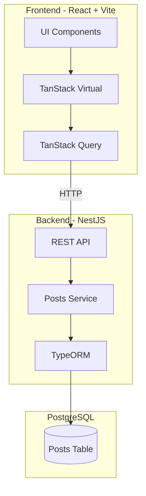

# 🔥 NewsFeed Dynamic

<div align="center">

**Высокопроизводительная лента новостей с глубокой виртуализацией**

[](https://www.typescriptlang.org/)
[](https://react.dev/)
[](https://nestjs.com/)
[](https://www.postgresql.org/)

</div>

---

## 📖 Описание проекта

**NewsFeed Dynamic** — это приложение, представляющее собой ленту новостей с бесконечным скроллом, полнотекстовым поиском и сложным медиа-контентом. Основной фокус проекта — **глубокая проработка алгоритмов виртуализации** для элементов с динамической высотой.

### 🎯 Ключевая задача

Минимизация **Layout Shift** и создание эффективной виртуализации для списков с элементами, размер которых зависит от:

- Длины текстового контента
- Загруженных медиа-файлов (изображения/видео)
- Интерактивных действий пользователя (раскрытие текста)

---

## ✨ Функциональность

### 📜 Виртуализированный список

| Функция | Описание |
|---------|----------|
| **Динамический расчет высоты** | Рендеринг элементов, размер которых зависит от контента |
| **Кэширование геометрии** | Сохранение рассчитанных высот для каждого `id` поста |
| **Scroll Anchoring** | Удержание позиции скролла при изменении контента внутри элементов |

### 🔍 Поиск и фильтрация

- **Полнотекстовый поиск** — глобальный поиск по ленте через бэкенд
- **Reset & Re-calculate** — полный сброс виртуализированного списка при обновлении запроса
- **Highlighting** — подсветка найденных слов в карточках

### 📦 Контентные блоки

- **Медиа-контент** — изображения с разными соотношениями сторон и видео-плееры
- **Интерактив** — кнопка «Показать больше» (expand) для длинных текстов

---

## 🏗️ Архитектура системы



---

## 🛠️ Технологический стек

### Backend

| Технология | Назначение |
|------------|------------|
| [NestJS](https://nestjs.com) | Node.js framework |
| [TypeORM](https://typeorm.io) | Data Mapper pattern |
| [PostgreSQL](https://www.postgresql.org) | Хранение 10,000+ постов |
| TypeScript | Типизация |

### Frontend

| Технология | Назначение |
|------------|------------|
| [React.js](https://react.dev) | UI библиотека |
| [TypeScript](https://www.typescriptlang.org) | Типизация |
| [Vite](https://vitejs.dev) | Сборщик |
| [TanStack Query](https://tanstack.com) | Server State Management |
| [TanStack Virtual](https://tanstack.com) | Virtualization Engine |

---

## 📁 Структура проекта

```
NewsFeed/
├── backend/
├── frontend/
└── doc/
```

---

## 🔌 API

### Основной Endpoint

```
GET /posts?limit=20&cursor=ID&search=text
```

### Response

```typescript
interface PostsResponse {
  items: Post[];
  nextCursor: string | null;
  hasMore: boolean;
}
```

### Post Entity

```typescript
interface Post {
  id: string;              // UUID - ключ для React list keys
  title: string;
  content: string;         // Динамический текст разной длины
  attachments: Attachment[];
  createdAt: Date;
  cursorId: number;        // BigInt для Seek Pagination
}

interface Attachment {
  type: 'image' | 'video';
  url: string;
  aspectRatio: number;     // Критически важно для предотвращения Layout Shift
}
```

---

## ⚙️ Технические особенности

### Пагинация

Используется **Seek Method (Cursor-based)** пагинация:
- Стабильность выборки при добавлении новых записей
- Оптимизированная работа с большими объемами данных

```sql
WHERE cursorId < :cursor
  AND (title ILIKE :search OR content ILIKE :search)
ORDER BY cursorId DESC
LIMIT :limit
```

### Виртуализация

```typescript
const rowVirtualizer = useVirtualizer({
  count: posts.length,
  getScrollElement: () => parentRef.current,
  estimateSize: () => 400,
  measureElement: (el) => el.getBoundingClientRect().height,
});
```

### Борьба с Layout Shift

```typescript
// Резервирование места под медиа до загрузки
<div style={{ aspectRatio: `${media.aspectRatio}`, width: '100%' }}>
  
</div>
```

---

## 🚀 Быстрый старт

### Предварительные требования

- Node.js 18+
- PostgreSQL 15+
- npm или yarn

### Установка

```bash
# Клонирование репозитория
git clone <repository-url>
cd NewsFeed

# Установка зависимостей backend
cd backend
npm install

# Установка зависимостей frontend
cd ../frontend
npm install
```

### Запуск

```bash
# Запуск PostgreSQL через Docker
cd backend
docker-compose up -d

# Запуск backend
npm run start:dev

# Запуск frontend (в новом терминале)
cd ../frontend
npm run dev
```

---

## 📚 Документация

- [PRD (Product Requirements Document)](doc/prd.md) — требования к продукту
- [ADR (Architecture Design Record)](doc/adr.md) — архитектурные решения

---

## 📝 Лицензия

MIT License
