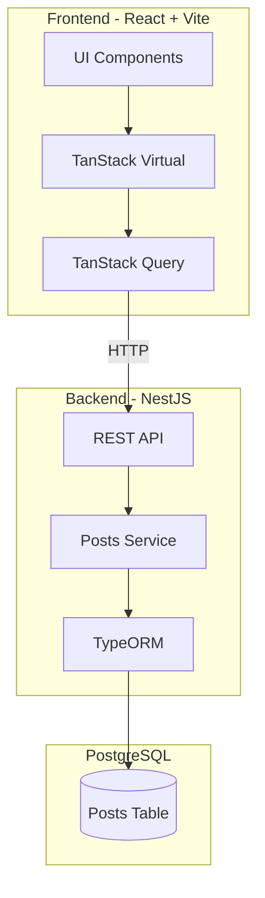

# High-performance NewsFeed

<div align="center">

**High-performance news feed with deep virtualization**

[](https://www.typescriptlang.org/)
[](https://react.dev/)
[](https://nestjs.com/)
[](https://www.postgresql.org/)

</div>

---

## Project Description

**High-Performance NewsFeed** is an application featuring a news feed with infinite scroll, full-text search, and rich media content. The main focus of the project is **deep implementation of virtualization algorithms** for elements with dynamic height.

### Key Objective

Minimization of **Layout Shift** and creating efficient virtualization for lists with elements whose size depends on:

- Length of text content
- Loaded media files (images/videos)
- Interactive user actions (text expansion)

---

## ✨ Features

### Virtualized List

| Feature | Description |
|---------|-------------|
| **Dynamic height calculation** | Rendering elements whose size depends on content |
| **Geometry caching** | Storing calculated heights for each post `id` |
| **Scroll Anchoring** | Maintaining scroll position when content inside elements changes |

### Search and Filtering

- **Full-text search** — global feed search via backend
- **Reset & Re-calculate** — complete reset of the virtualized list when query is updated
- **Highlighting** — highlighting found words in cards

### Content Blocks

- **Media content** — images with different aspect ratios and video players
- **Interaction** — "Show more" button (expand) for long texts

---

## System Architecture



---

## 🛠️ Technology Stack

### Backend

| Technology | Purpose |
|------------|---------|
| [NestJS](https://nestjs.com) | Node.js framework |
| [TypeORM](https://typeorm.io) | Data Mapper pattern |
| [PostgreSQL](https://www.postgresql.org) | Storing 10,000+ posts |
| TypeScript | Typing |

### Frontend

| Technology | Purpose |
|------------|---------|
| [React.js](https://react.dev) | UI library |
| [TypeScript](https://www.typescriptlang.org) | Typing |
| [Vite](https://vitejs.dev) | Build tool |
| [TanStack Query](https://tanstack.com) | Server State Management |
| [TanStack Virtual](https://tanstack.com) | Virtualization Engine |

---

## 📁 Project Structure

```
NewsFeed/
├── backend/
├── frontend/
└── doc/
```

---

## API

### Main Endpoint

```
GET /posts?limit=20&cursor=ID&search=text
```

### Response

```typescript
interface PostsResponse {
  items: Post[];
  nextCursor: string | null;
  hasMore: boolean;
}
```

### Post Entity

```typescript
interface Post {
  id: string;              // UUID - key for React list keys
  title: string;
  content: string;         // Dynamic text of varying length
  attachments: Attachment[];
  createdAt: Date;
  cursorId: number;        // BigInt for Seek Pagination
}

interface Attachment {
  type: 'image' | 'video';
  url: string;
  aspectRatio: number;     // Critically important for preventing Layout Shift
}
```

---

## ⚙️ Technical Features

### Pagination

**Seek Method (Cursor-based)** pagination is used:
- Stable selection when adding new records
- Optimized performance with large data volumes

```sql
WHERE cursorId < :cursor
  AND (title ILIKE :search OR content ILIKE :search)
ORDER BY cursorId DESC
LIMIT :limit
```

### Virtualization

```typescript
const rowVirtualizer = useVirtualizer({
  count: posts.length,
  getScrollElement: () => parentRef.current,
  estimateSize: () => 400,
  measureElement: (el) => el.getBoundingClientRect().height,
});
```

### Fighting Layout Shift

```typescript
// Reserving space for media before loading
<div style={{ aspectRatio: `${media.aspectRatio}`, width: '100%' }}>
  
</div>
```

---

## 🚀 Quick Start

### Prerequisites

- Node.js 18+
- PostgreSQL 15+
- npm or yarn

### Installation

```bash
# Cloning the repository
git clone <repository-url>
cd NewsFeed

# Installing backend dependencies
cd backend
npm install

# Installing frontend dependencies
cd ../frontend
npm install
```

### Running

```bash
# Running PostgreSQL via Docker
cd backend
docker-compose up -d

# Running backend
npm run start:dev

# Running frontend (in a new terminal)
cd ../frontend
npm run dev
```

---

## 📚 Documentation

- [PRD (Product Requirements Document)](doc/prd.md) — product requirements
- [ADR (Architecture Design Record)](doc/adr.md) — architectural decisions

---

## 📝 License

MIT License
