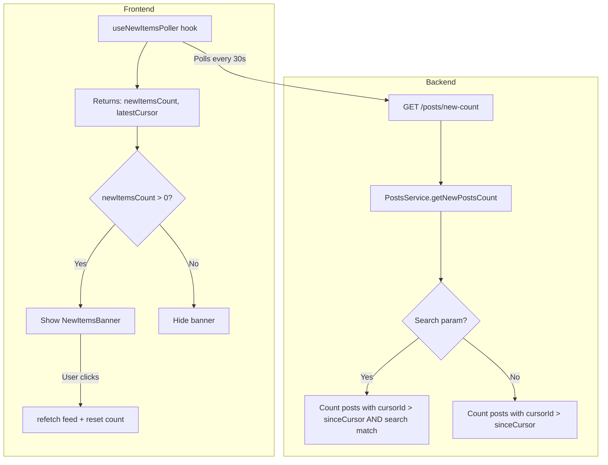
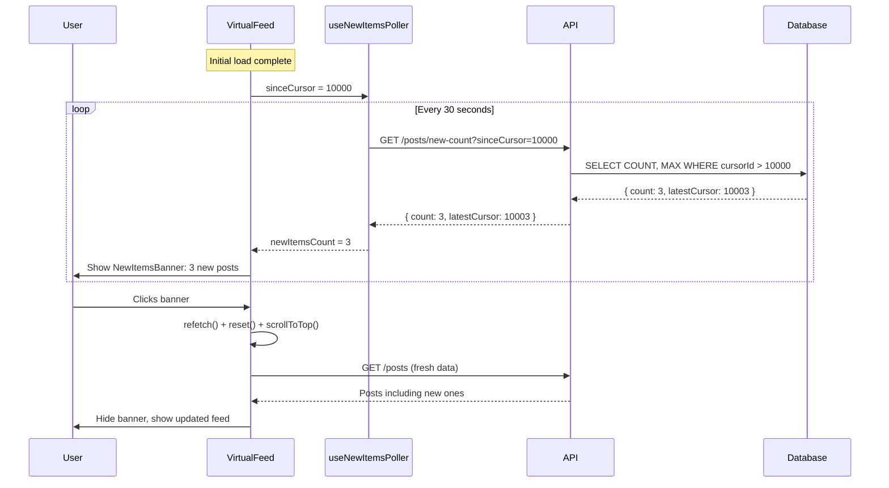

# New Items Banner Implementation Plan

## Overview

This document outlines the implementation plan for a "New Items Banner" feature that addresses the caching issue where new posts don't appear at the top of the feed due to React Query's `staleTime: 5 minutes` and `refetchOnWindowFocus: false` settings.

## Problem Statement

- Current first post has `cursorId: 10000` (highest = newest)
- New posts get higher `cursorId` values via auto-increment
- React Query caches data for 5 minutes, preventing new posts from appearing
- Users need manual refresh to see new content

## Solution Architecture



---

## 1. Backend API Endpoint Specification

### 1.1 New Endpoint: `GET /posts/new-count`

A lightweight endpoint that returns only the count of new posts since a given cursor.

#### Request

| Parameter     | Type   | Required | Description                                |
|:--------------|:-------|:---------|:-------------------------------------------|
| `sinceCursor` | string | Yes      | The cursor ID to check for new items after |
| `search`      | string | No       | Search query to filter new items           |

#### Response

```typescript
interface NewPostsCountResponse {
  count: number;        // Number of new posts since sinceCursor
  latestCursor: string; // Highest cursorId among new posts (for updating tracking)
}
```

#### Example

```http
GET /posts/new-count?sinceCursor=10000
Response: { "count": 5, "latestCursor": "10005" }

GET /posts/new-count?sinceCursor=10000&search=react
Response: { "count": 2, "latestCursor": "10004" }
```

### 1.2 Service Method: `PostsService.getNewPostsCount`

```typescript
async getNewPostsCount(sinceCursor: string, search?: string): Promise<NewPostsCountResponse>
```

**Implementation Logic:**

1. Parse `sinceCursor` to number
2. Build query with `WHERE cursorId > sinceCursor`
3. If `search` provided, add ILIKE filter on title/content
4. Use `COUNT()` and `MAX()` aggregations for efficiency
5. Return count and latest cursor

**SQL Query Example:**

```sql
SELECT COUNT(*) as count, MAX("cursorId") as "latestCursor"
FROM posts
WHERE "cursorId" > $1
  AND (title ILIKE '%search%' OR content ILIKE '%search%')
```

### 1.3 DTO Specification

```typescript
// dto/get-new-count.dto.ts
export class GetNewCountDto {
  @IsString()
  @IsNotEmpty()
  sinceCursor!: string;

  @IsOptional()
  @IsString()
  search?: string;
}
```

---

## 2. Frontend Hook Design

### 2.1 New Hook: `useNewItemsPoller`

A custom hook that polls the new-count endpoint and manages the banner state.

#### Interface

```typescript
interface UseNewItemsPollerOptions {
  sinceCursor: string | null;  // Current highest cursor in feed
  searchQuery?: string;        // Current search context
  pollingInterval?: number;    // Default: 30000ms (30 seconds)
  enabled?: boolean;           // Default: true
}

interface UseNewItemsPollerReturn {
  newItemsCount: number;       // Number of new items detected
  latestCursor: string | null; // Latest cursor from new items
  isPolling: boolean;          // Polling status
  reset: () => void;           // Reset count to 0 (after user clicks banner)
}
```

#### Implementation Details

```typescript
export function useNewItemsPoller(options: UseNewItemsPollerOptions): UseNewItemsPollerReturn
```

**Key Features:**

1. Uses `useQuery` with `refetchInterval` for polling
2. Only enabled when `sinceCursor` is available and `enabled: true`
3. Includes `searchQuery` in query key for proper cache separation
4. Returns `reset()` function to clear the count after user interaction

**React Query Configuration:**

```typescript
useQuery({
  queryKey: ['new-posts-count', sinceCursor, searchQuery],
  queryFn: () => postsApi.getNewPostsCount({
    sinceCursor: sinceCursor!,
    search: searchQuery
  }),
  enabled: !!sinceCursor && enabled,
  refetchInterval: pollingInterval,
  staleTime: 0,           // Always fetch fresh data
  refetchOnWindowFocus: true, // Check immediately when user returns
})
```

### 2.2 API Client Extension

Add new method to [`postsApi`](../frontend/src/api/posts.ts):

```typescript
export const postsApi = {
  // ... existing methods

  getNewPostsCount: async (params: GetNewPostsCountParams): Promise<NewPostsCountResponse> => {
    const response = await apiClient.get<NewPostsCountResponse>('/posts/new-count', {
      params: {
        sinceCursor: params.sinceCursor,
        search: params.search || undefined,
      },
    });
    return response.data;
  },
};
```

### 2.3 Type Definitions

Add to [`types/api.ts`](../frontend/src/types/api.ts):

```typescript
export interface GetNewPostsCountParams {
  sinceCursor: string;
  search?: string;
}

export interface NewPostsCountResponse {
  count: number;
  latestCursor: string;
}
```

---

## 3. UI Component Design

### 3.1 New Component: `NewItemsBanner`

A banner that appears at the top of the feed when new items are detected.

#### Props Interface

```typescript
interface NewItemsBannerProps {
  count: number;              // Number of new items
  onRefresh: () => void;      // Callback when user clicks banner
  isVisible: boolean;         // Control visibility
}
```

#### Visual Design

```
┌──────────────────────────────────────────────────────────┐
│  📢 5 new posts available - Click to refresh             │
└──────────────────────────────────────────────────────────┘
```

**Styling:**

- Position: Fixed/sticky at top of viewport or below search
- Color: Primary blue background with white text
- Icon: Bell or arrow-up icon
- Animation: Slide down when appearing
- Cursor: Pointer (clickable)

**Behavior:**

- Only visible when `count > 0` and `isVisible: true`
- Click triggers `onRefresh` and hides banner
- Smooth slide-up/slide-down transition

#### Component Structure

```tsx
export const NewItemsBanner: React.FC<NewItemsBannerProps> = ({
  count,
  onRefresh,
  isVisible,
}) => {
  if (!isVisible || count === 0) return null;

  return (
    <div
      className="sticky top-0 z-10 bg-blue-600 text-white py-2 px-4
                 cursor-pointer hover:bg-blue-700 transition-colors
                 animate-slide-down"
      onClick={onRefresh}
      role="button"
      aria-label={`Show ${count} new posts`}
    >
      <div className="flex items-center justify-center gap-2">
        <HiArrowUp className="w-5 h-5" />
        <span className="font-medium">
          {count === 1
            ? '1 new post available'
            : `${count} new posts available`}
        </span>
        <span className="text-blue-200">- Click to refresh</span>
      </div>
    </div>
  );
};
```

---

## 4. Integration Points

### 4.1 VirtualFeed Component Integration

The [`VirtualFeed`](../frontend/src/components/VirtualFeed/index.tsx) component needs modification to:

1. Track the first (highest) cursor in the current feed
2. Use the `useNewItemsPoller` hook
3. Render the `NewItemsBanner` component
4. Handle refresh action

#### Changes to VirtualFeed

```tsx
// Add imports
import { useNewItemsPoller } from '../../hooks/useNewItemsPoller';
import { NewItemsBanner } from '../NewItemsBanner';

// Inside component:
// Get the highest cursor from first post
const firstPostCursor = posts.length > 0 ? posts[0].cursorId.toString() : null;

// Polling hook
const { newItemsCount, reset } = useNewItemsPoller({
  sinceCursor: firstPostCursor,
  searchQuery,
  pollingInterval: 30000,
});

// Refresh handler
const handleRefreshNewItems = useCallback(() => {
  refetch();  // Trigger full refetch from React Query
  reset();    // Reset the new items count
  scrollToTop();
}, [refetch, reset, scrollToTop]);

// In JSX, add banner before the list
<NewItemsBanner
  count={newItemsCount}
  onRefresh={handleRefreshNewItems}
  isVisible={!isLoading}
/>
```

### 4.2 useVirtualFeed Hook Extension

The [`useVirtualFeed`](../frontend/src/hooks/useVirtualFeed.ts) hook needs to expose:

```typescript
interface UseVirtualFeedReturn<T> {
  // ... existing properties

  // Add refetch capability
  refetch: () => void;
}
```

This is obtained from `useInfiniteQuery`'s returned `refetch` method.

### 4.3 Data Flow Diagram



---

## 5. File Structure

### 5.1 Files to Create

```
backend/src/
├── posts/
│   ├── dto/
│   │   └── get-new-count.dto.ts     # NEW: DTO for new-count endpoint

frontend/src/
├── api/
│   └── posts.ts                      # MODIFY: Add getNewPostsCount method
├── components/
│   └── NewItemsBanner/
│       └── index.tsx                 # NEW: Banner component
├── hooks/
│   └── useNewItemsPoller.ts          # NEW: Polling hook
├── types/
│   └── api.ts                        # MODIFY: Add new types
```

### 5.2 Files to Modify

| File                                                                                                | Changes                                               |
|:----------------------------------------------------------------------------------------------------|:------------------------------------------------------|
| [`backend/src/posts/posts.controller.ts`](../backend/src/posts/posts.controller.ts)                 | Add `@Get('new-count')` endpoint                      |
| [`backend/src/posts/posts.service.ts`](../backend/src/posts/posts.service.ts)                       | Add `getNewPostsCount()` method                       |
| [`frontend/src/api/posts.ts`](../frontend/src/api/posts.ts)                                         | Add `getNewPostsCount()` API method                   |
| [`frontend/src/hooks/useVirtualFeed.ts`](../frontend/src/hooks/useVirtualFeed.ts)                   | Expose `refetch` from useInfiniteQuery                |
| [`frontend/src/components/VirtualFeed/index.tsx`](../frontend/src/components/VirtualFeed/index.tsx) | Integrate banner and polling                          |
| [`frontend/src/types/api.ts`](../frontend/src/types/api.ts)                                         | Add `GetNewPostsCountParams`, `NewPostsCountResponse` |

---

## 6. Implementation Order

### Phase 1: Backend

1. Create `GetNewCountDto` in [`dto/get-new-count.dto.ts`](../backend/src/posts/dto/get-new-count.dto.ts)
2. Add `getNewPostsCount()` method to [`PostsService`](../backend/src/posts/posts.service.ts)
3. Add `@Get('new-count')` endpoint to [`PostsController`](../backend/src/posts/posts.controller.ts)
4. Test endpoint with httpie: `http GET :3000/posts/new-count sinceCursor=10000`

### Phase 2: Frontend Types & API

1. Add types to [`types/api.ts`](../frontend/src/types/api.ts)
2. Add `getNewPostsCount()` to [`api/posts.ts`](../frontend/src/api/posts.ts)
3. Test API integration

### Phase 3: Frontend Hook

1. Create [`useNewItemsPoller.ts`](../frontend/src/hooks/useNewItemsPoller.ts)
2. Add unit tests for the hook

### Phase 4: UI Component

1. Create [`NewItemsBanner/index.tsx`](../frontend/src/components/NewItemsBanner/index.tsx)
2. Add CSS animations for slide effect

### Phase 5: Integration

1. Modify [`useVirtualFeed.ts`](../frontend/src/hooks/useVirtualFeed.ts) to expose `refetch`
2. Integrate into [`VirtualFeed/index.tsx`](../frontend/src/components/VirtualFeed/index.tsx)
3. End-to-end testing

---

## 7. Edge Cases & Considerations

### 7.1 Search Context

- When user has an active search, only count new items matching that search
- Banner should update when search changes
- If search changes, reset the count and start fresh polling

### 7.2 Scroll Position

- After clicking banner, user should be scrolled to top
- Existing scroll position in virtual list will be invalidated
- Consider using `scrollToTop()` from `useVirtualFeed`

### 7.3 Empty Feed

- If feed is empty (no posts), disable polling
- `sinceCursor` would be null, so hook should return `enabled: false`

### 7.4 Concurrent Updates

- Multiple polls might return increasing counts
- Always use the latest `latestCursor` for subsequent polls
- Reset properly after refresh to avoid showing stale counts

### 7.5 Network Errors

- If polling fails, silently retry on next interval
- Don't show error to user for background polling failures
- Log errors for debugging

### 7.6 Performance

- Backend query uses indexed `cursorId` column - very fast
- Response is minimal (2 numbers)
- Polling interval of 30s is conservative; consider 60s for lower traffic

---

## 8. Testing Strategy

### 8.1 Backend Tests

- Unit test for `PostsService.getNewPostsCount()`
- E2E test for `GET /posts/new-count` endpoint
- Test with and without search parameter
- Test with invalid cursor (should return 400)

### 8.2 Frontend Tests

- Unit test for `useNewItemsPoller` hook
- Component test for `NewItemsBanner`
- Integration test for VirtualFeed with banner

### 8.3 Manual Testing Checklist

- [ ] Banner appears when new posts are added
- [ ] Banner shows correct count
- [ ] Click refreshes feed and hides banner
- [ ] Search filtering works correctly
- [ ] Polling continues after refresh
- [ ] No memory leaks on unmount
