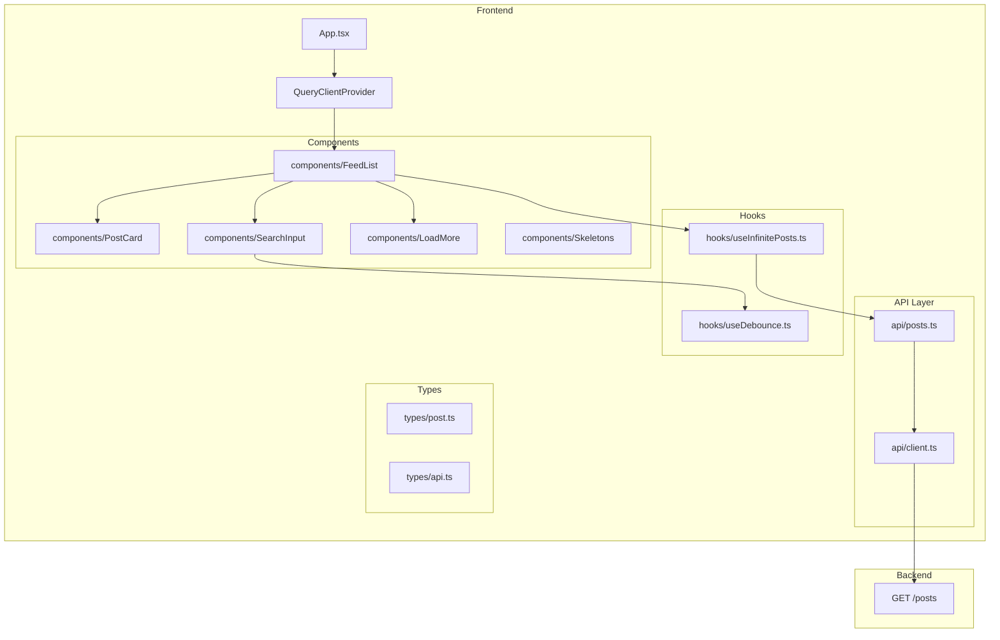

# Phase 2: Frontend Data Layer (Server State) - Detailed Plan

## Overview

**Goal:** Implement infinite scroll data fetching on the frontend without virtualization, preparing the foundation for UI integration.

**Dependencies:** Completed Phase 1 (Backend API), React (Vite), TanStack Query

**Decisions Made:**

- **Type synchronization:** Manual TypeScript interfaces in `frontend/src/types/`
- **Search debounce:** 500ms delay
- **UX patterns:** Enhanced (Skeleton loaders + spinner + inline error alerts)
- **UI Components:** Use Flowbite React components (Card, Button, TextInput, Navbar, Alert, Spinner)

---

## Architecture Diagram



---

## Implementation Steps

### Step 1: Install Dependencies

**Files to modify:** `frontend/package.json`

**Dependencies to add:**

- `@tanstack/react-query` - Server state management
- `axios` - HTTP client

```bash
npm install @tanstack/react-query axios
```

> **Note:** No need for `react-hot-toast` - we'll use Flowbite React's `<Alert>` component for error messages.

---

### Step 2: Create TypeScript Types

**Files to create:**

- `frontend/src/types/post.ts` - Post entity types
- `frontend/src/types/api.ts` - API response types

#### `frontend/src/types/post.ts`

```typescript
export interface Attachment {
  type: 'image' | 'video';
  url: string;
  aspectRatio: number;
}

export interface Post {
  id: string;
  title: string;
  content: string;
  attachments?: Attachment[];
  createdAt: string; // ISO date string
  cursorId: number;
}
```

#### `frontend/src/types/api.ts`

```typescript
import { Post } from './post';

export interface PaginatedResponse<T> {
  items: T[];
  nextCursor: string | null;
  hasMore: boolean;
}

export interface GetPostsParams {
  limit?: number;
  cursor?: string;
  search?: string;
}

export type PostsResponse = PaginatedResponse<Post>;
```

---

### Step 3: Create API Client

**Files to create:**

- `frontend/src/api/client.ts` - Axios instance configuration
- `frontend/src/api/posts.ts` - Posts API functions

#### `frontend/src/api/client.ts`

```typescript
import axios from 'axios';

const API_BASE_URL = import.meta.env.VITE_API_URL || 'http://localhost:3000';

export const apiClient = axios.create({
  baseURL: API_BASE_URL,
  headers: {
    'Content-Type': 'application/json',
  },
});

// Optional: Add request/response interceptors for error handling
apiClient.interceptors.response.use(
  (response) => response,
  (error) => {
    // Global error handling
    console.error('API Error:', error);
    return Promise.reject(error);
  }
);
```

#### `frontend/src/api/posts.ts`

```typescript
import { apiClient } from './client';
import { PostsResponse, GetPostsParams } from '../types/api';

export const postsApi = {
  getPosts: async (params: GetPostsParams): Promise<PostsResponse> => {
    const response = await apiClient.get<PostsResponse>('/posts', {
      params: {
        limit: params.limit ?? 20,
        cursor: params.cursor,
        search: params.search || undefined,
      },
    });
    return response.data;
  },
};
```

---

### Step 4: Create Custom Hooks

**Files to create:**

- `frontend/src/hooks/useDebounce.ts` - Debounce hook for search
- `frontend/src/hooks/useInfinitePosts.ts` - Infinite query hook

#### `frontend/src/hooks/useDebounce.ts`

```typescript
import { useState, useEffect } from 'react';

export function useDebounce<T>(value: T, delay: number): T {
  const [debouncedValue, setDebouncedValue] = useState<T>(value);

  useEffect(() => {
    const timer = setTimeout(() => {
      setDebouncedValue(value);
    }, delay);

    return () => {
      clearTimeout(timer);
    };
  }, [value, delay]);

  return debouncedValue;
}
```

#### `frontend/src/hooks/useInfinitePosts.ts`

```typescript
import { useInfiniteQuery } from '@tanstack/react-query';
import { postsApi } from '../api/posts';

interface UseInfinitePostsOptions {
  search?: string;
  pageSize?: number;
}

export function useInfinitePosts(options: UseInfinitePostsOptions = {}) {
  const { search = '', pageSize = 20 } = options;

  return useInfiniteQuery({
    queryKey: ['posts', { search, pageSize }],
    queryFn: ({ pageParam }) =>
      postsApi.getPosts({
        limit: pageSize,
        cursor: pageParam,
        search: search || undefined,
      }),
    initialPageParam: undefined as string | undefined,
    getNextPageParam: (lastPage) => {
      if (!lastPage.hasMore || !lastPage.nextCursor) {
        return undefined;
      }
      return lastPage.nextCursor;
    },
    // Refetch on window focus for fresh data
    refetchOnWindowFocus: false,
    // Stale time to avoid unnecessary refetches
    staleTime: 1000 * 60 * 5, // 5 minutes
  });
}
```

---

### Step 5: Create UI Components

**Files to create:**

- `frontend/src/components/Skeleton/PostSkeleton.tsx` - Loading skeleton using Tailwind CSS
- `frontend/src/components/PostCard/PostCard.tsx` - Post card using Flowbite Card
- `frontend/src/components/SearchInput/SearchInput.tsx` - Search using Flowbite TextInput
- `frontend/src/components/FeedList/FeedList.tsx` - Main feed container
- `frontend/src/components/LoadMore/LoadMore.tsx` - Load more button using Flowbite Button

#### `frontend/src/components/Skeleton/PostSkeleton.tsx`

> **Note:** Flowbite React doesn't have a dedicated Skeleton component. We create one using Tailwind CSS classes that match Flowbite's design system.

```typescript
export const PostSkeleton = () => (
  <div
    className="animate-pulse rounded-lg border border-gray-200 bg-white p-4 shadow-sm dark:border-gray-700 dark:bg-gray-800"
    role="status"
    aria-label="Loading"
  >
    {/* Title skeleton */}
    <div className="mb-3 h-6 w-3/4 rounded-full bg-gray-200 dark:bg-gray-700" />

    {/* Content skeleton - multiple lines */}
    <div className="space-y-2">
      <div className="h-4 w-full rounded-full bg-gray-200 dark:bg-gray-700" />
      <div className="h-4 w-5/6 rounded-full bg-gray-200 dark:bg-gray-700" />
      <div className="h-4 w-4/6 rounded-full bg-gray-200 dark:bg-gray-700" />
    </div>

    {/* Image placeholder skeleton */}
    <div className="mt-3 h-48 w-full rounded-lg bg-gray-200 dark:bg-gray-700" />

    {/* Date skeleton */}
    <div className="mt-3 h-3 w-24 rounded-full bg-gray-200 dark:bg-gray-700" />

    <span className="sr-only">Loading...</span>
  </div>
);
```

#### `frontend/src/components/PostCard/PostCard.tsx`

```typescript
import { Card } from 'flowbite-react';
import { Post } from '../../types/post';

interface PostCardProps {
  post: Post;
}

export const PostCard = ({ post }: PostCardProps) => {
  return (
    <Card className="transition-shadow hover:shadow-md">
      <h3 className="mb-2 text-lg font-semibold text-gray-900 dark:text-white">
        {post.title}
      </h3>

      <p className="mb-3 text-gray-700 dark:text-gray-300 line-clamp-4">
        {post.content}
      </p>

      {post.attachments && post.attachments.length > 0 && (
        <div className="mt-3 space-y-3">
          {post.attachments.map((attachment, index) => (
            <div
              key={index}
              className="overflow-hidden rounded-lg bg-gray-100 dark:bg-gray-700"
              style={{ aspectRatio: attachment.aspectRatio }}
            >
              {attachment.type === 'image' ? (
                
              ) : (
                <video
                  src={attachment.url}
                  className="h-full w-full object-cover"
                  controls
                />
              )}
            </div>
          ))}
        </div>
      )}

      <time className="mt-3 block text-sm text-gray-500 dark:text-gray-400">
        {new Date(post.createdAt).toLocaleDateString()}
      </time>
    </Card>
  );
};
```

#### `frontend/src/components/SearchInput/SearchInput.tsx`

```typescript
import { useState, useCallback } from 'react';
import { TextInput } from 'flowbite-react';
import { HiSearch, HiX } from 'react-icons/hi';

interface SearchInputProps {
  value: string;
  onChange: (value: string) => void;
  placeholder?: string;
}

export const SearchInput = ({
  value,
  onChange,
  placeholder = 'Search posts...'
}: SearchInputProps) => {
  const [localValue, setLocalValue] = useState(value);

  const handleChange = useCallback(
    (e: React.ChangeEvent<HTMLInputElement>) => {
      const newValue = e.target.value;
      setLocalValue(newValue);
      onChange(newValue);
    },
    [onChange]
  );

  const handleClear = useCallback(() => {
    setLocalValue('');
    onChange('');
  }, [onChange]);

  return (
    <div className="relative">
      <TextInput
        type="text"
        value={localValue}
        onChange={handleChange}
        placeholder={placeholder}
        className="w-full"
        sizing="lg"
        icon={HiSearch}
      />
      {localValue && (
        <button
          onClick={handleClear}
          className="absolute right-3 top-1/2 -translate-y-1/2 text-gray-500 hover:text-gray-700 dark:text-gray-400 dark:hover:text-gray-200"
          type="button"
          aria-label="Clear search"
        >
          <HiX className="h-5 w-5" />
        </button>
      )}
    </div>
  );
};
```

#### `frontend/src/components/LoadMore/LoadMore.tsx`

```typescript
import { Button, Spinner } from 'flowbite-react';

interface LoadMoreProps {
  onClick: () => void;
  isLoading: boolean;
  hasMore: boolean;
}

export const LoadMore = ({ onClick, isLoading, hasMore }: LoadMoreProps) => {
  if (!hasMore) {
    return (
      <p className="py-4 text-center text-gray-500 dark:text-gray-400">
        No more posts to load
      </p>
    );
  }

  return (
    <div className="flex justify-center py-4">
      <Button onClick={onClick} disabled={isLoading} size="lg" color="blue">
        {isLoading ? (
          <>
            <Spinner className="mr-2" size="sm" />
            Loading...
          </>
        ) : (
          'Load More'
        )}
      </Button>
    </div>
  );
};
```

#### `frontend/src/components/FeedList/FeedList.tsx`

```typescript
import { useState } from 'react';
import { Alert } from 'flowbite-react';
import { HiInformationCircle } from 'react-icons/hi';
import { useInfinitePosts } from '../../hooks/useInfinitePosts';
import { useDebounce } from '../../hooks/useDebounce';
import { PostCard } from '../PostCard/PostCard';
import { PostSkeleton } from '../Skeleton/PostSkeleton';
import { SearchInput } from '../SearchInput/SearchInput';
import { LoadMore } from '../LoadMore/LoadMore';

const SEARCH_DEBOUNCE_MS = 500;

export const FeedList = () => {
  const [searchInput, setSearchInput] = useState('');
  const debouncedSearch = useDebounce(searchInput, SEARCH_DEBOUNCE_MS);

  const {
    data,
    isLoading,
    isError,
    error,
    fetchNextPage,
    hasNextPage,
    isFetchingNextPage,
  } = useInfinitePosts({
    search: debouncedSearch,
  });

  // Flatten pages into single array
  const posts = data?.pages.flatMap((page) => page.items) ?? [];

  return (
    <div className="mx-auto max-w-2xl p-4">
      {/* Search Header */}
      <div className="mb-6">
        <SearchInput
          value={searchInput}
          onChange={setSearchInput}
          placeholder="Search posts by title or content..."
        />
      </div>

      {/* Error State - Using Flowbite Alert */}
      {isError && (
        <Alert
          color="failure"
          icon={HiInformationCircle}
          className="mb-4"
        >
          <span className="font-medium">Error loading posts!</span>{' '}
          {error instanceof Error ? error.message : 'Please try again later.'}
        </Alert>
      )}

      {/* Initial Loading State */}
      {isLoading && (
        <div className="space-y-4">
          {Array.from({ length: 5 }).map((_, i) => (
            <PostSkeleton key={i} />
          ))}
        </div>
      )}

      {/* Posts List */}
      {!isLoading && (
        <>
          <div className="space-y-4">
            {posts.map((post) => (
              <PostCard key={post.id} post={post} />
            ))}
          </div>

          {/* Load More Button */}
          <LoadMore
            onClick={() => fetchNextPage()}
            isLoading={isFetchingNextPage}
            hasMore={hasNextPage ?? false}
          />
        </>
      )}

      {/* Empty State */}
      {!isLoading && posts.length === 0 && !isError && (
        <div className="py-12 text-center">
          <p className="text-gray-500 dark:text-gray-400">
            {debouncedSearch
              ? 'No posts found matching your search.'
              : 'No posts available.'}
          </p>
        </div>
      )}
    </div>
  );
};
```

---

### Step 6: Setup Query Client Provider

**Files to modify:**

- `frontend/src/main.tsx` - Add QueryClientProvider

#### `frontend/src/main.tsx`

```typescript
import { StrictMode } from 'react';
import { createRoot } from 'react-dom/client';
import { QueryClient, QueryClientProvider } from '@tanstack/react-query';
import './index.css';
import App from './App';

const queryClient = new QueryClient({
  defaultOptions: {
    queries: {
      retry: 1,
      refetchOnWindowFocus: false,
    },
  },
});

createRoot(document.getElementById('root')!).render(
  <StrictMode>
    <QueryClientProvider client={queryClient}>
      <App />
    </QueryClientProvider>
  </StrictMode>
);
```

---

### Step 7: Update App Component

**Files to modify:**

- `frontend/src/App.tsx` - Use Flowbite Navbar and FeedList

#### `frontend/src/App.tsx`

```typescript
import { Navbar } from 'flowbite-react';
import { FeedList } from './components/FeedList/FeedList';

function App() {
  return (
    <main className="min-h-screen bg-gray-50 dark:bg-gray-900">
      <Navbar fluid border>
        <Navbar.Brand href="/">
          <span className="self-center whitespace-nowrap text-xl font-semibold dark:text-white">
            News Feed
          </span>
        </Navbar.Brand>
      </Navbar>
      <FeedList />
    </main>
  );
}

export default App;
```

---

### Step 8: Environment Configuration

**Files to create:**

- `frontend/.env` - Environment variables (committed to repo)

#### `frontend/.env`

```env
VITE_API_URL=http://localhost:3000
```

> **Note:** This file contains no secrets and is safe to commit to the repository.

---

## File Structure After Phase 2

```
frontend/
├── src/
│   ├── api/
│   │   ├── client.ts         # Axios instance
│   │   └── posts.ts          # Posts API functions
│   ├── hooks/
│   │   ├── useDebounce.ts    # Debounce hook
│   │   └── useInfinitePosts.ts # Infinite query hook
│   ├── types/
│   │   ├── api.ts            # API types
│   │   └── post.ts           # Post entity types
│   ├── components/
│   │   ├── FeedList/
│   │   │   └── FeedList.tsx
│   │   ├── PostCard/
│   │   │   └── PostCard.tsx
│   │   ├── SearchInput/
│   │   │   └── SearchInput.tsx
│   │   ├── LoadMore/
│   │   │   └── LoadMore.tsx
│   │   └── Skeleton/
│   │       └── PostSkeleton.tsx
│   ├── App.tsx
│   ├── main.tsx              # With QueryClientProvider
│   └── index.css
├── .env
└── package.json              # With new dependencies
```

---

## Flowbite React Components Used

| Component | Usage | Import |
|-----------|-------|--------|
| `Card` | PostCard container | `import { Card } from 'flowbite-react'` |
| `Button` | Load More button | `import { Button } from 'flowbite-react'` |
| `TextInput` | Search input | `import { TextInput } from 'flowbite-react'` |
| `Spinner` | Loading indicator | `import { Spinner } from 'flowbite-react'` |
| `Alert` | Error messages | `import { Alert } from 'flowbite-react'` |
| `Navbar` | Page header | `import { Navbar } from 'flowbite-react'` |

---

## Definition of Done Checklist

- [ ] **Dependencies installed:** TanStack Query, Axios
- [ ] **Types created:** Post, Attachment, PaginatedResponse, GetPostsParams
- [ ] **API client configured:** Base URL from env, error interceptor
- [ ] **useInfinitePosts hook:** Returns flat posts array, handles pagination
- [ ] **useDebounce hook:** 500ms delay for search input
- [ ] **PostCard component:** Uses Flowbite Card, displays title, content, attachments, date
- [ ] **SearchInput component:** Uses Flowbite TextInput with icon, clearable
- [ ] **LoadMore component:** Uses Flowbite Button with Spinner, shows state
- [ ] **PostSkeleton component:** Uses Tailwind animate-pulse for loading state
- [ ] **FeedList component:** Combines all pieces, handles all states
- [ ] **QueryClient setup:** In main.tsx with sensible defaults
- [ ] **Error handling:** Flowbite Alert component for API errors
- [ ] **Loading states:** Skeletons for initial load, Spinner for pagination
- [ ] **Empty states:** Message when no posts or no search results
- [ ] **Navbar:** Uses Flowbite Navbar component

---

## Testing the Implementation

1. **Start the backend:**

   ```bash
   cd backend
   npm run start:dev
   ```

2. **Start the frontend:**

   ```bash
   cd frontend
   npm run dev
   ```

3. **Test scenarios:**
   - Initial load shows 5 skeleton loaders → posts appear
   - Clicking "Load More" fetches next 20 posts with spinner
   - Typing in search resets list after 500ms debounce
   - Clearing search shows all posts again
   - Disconnect backend → see error alert with Flowbite Alert
   - Scroll through all posts until "No more posts" message

---

## Notes for Phase 3

- The `FeedList` component will be refactored to use TanStack Virtual
- `PostCard` will need `measureElement` integration
- The simple list will become a virtualized scroll container
- Current structure is designed to be easily adaptable to virtualization
