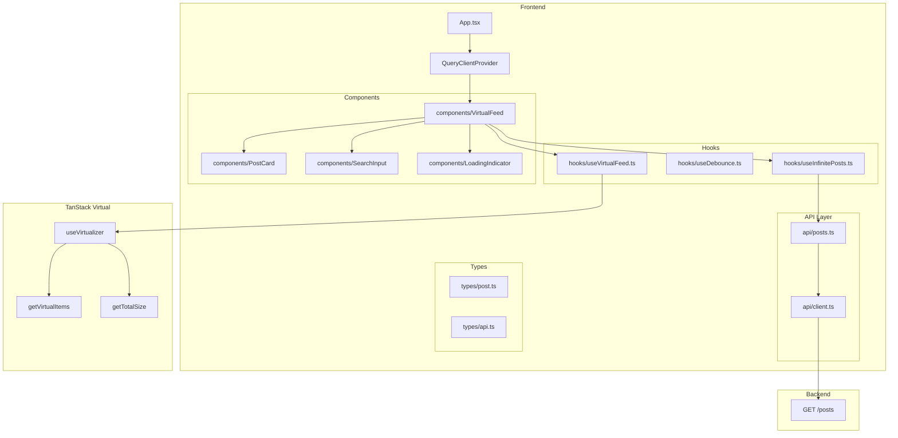
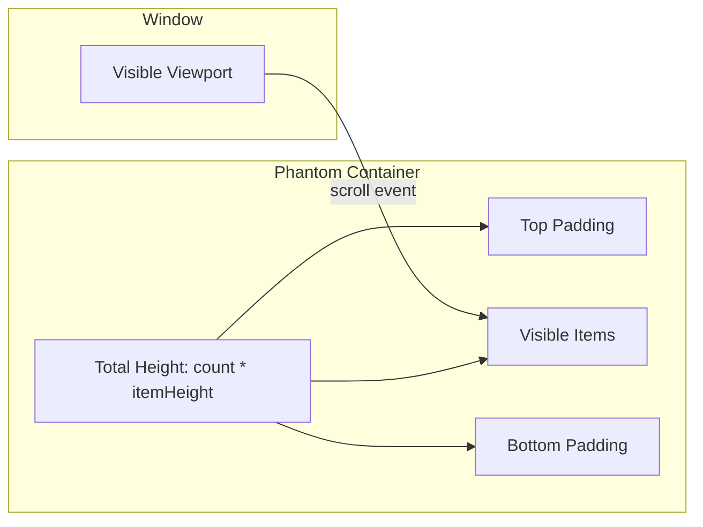

# Phase 3: Core Virtualization - Detailed Plan

## Overview

**Goal:** Integrate TanStack Virtual to manage element rendering based on scroll position, creating a high-performance virtualized feed.

**Dependencies:** Completed Phase 2, `@tanstack/react-virtual` library

**Decisions Made:**

- **Infinite Loading Strategy:** Automatic fetch on scroll (seamless UX)
- **Scroll Container:** Window scroll (native social media feel)
- **Item Size Strategy:** Fixed height with architectural preparation for Phase 4
- **Overscan:** 5 items
- **Loading Indicator:** Skeleton at bottom during fetch
- **Search Behavior:** Scroll-to-top on search change

---

## Architecture Diagram



---

## Virtual Scrolling Mechanism



### Key Concepts

1. **Phantom Container:** A tall empty div that creates the correct scrollbar height
2. **Windowing:** Only render items within viewport + overscan
3. **Absolute Positioning:** Items are absolutely positioned using `transform: translateY()`
4. **Recycling:** DOM nodes are reused as user scrolls

---

## Implementation Steps

### Step 1: Install TanStack Virtual

**Files to modify:** `frontend/package.json`

```bash
npm install @tanstack/react-virtual
```

---

### Step 2: Create useVirtualFeed Hook

**Files to create:**

- `frontend/src/hooks/useVirtualFeed.ts` - Virtualization logic encapsulation

#### `frontend/src/hooks/useVirtualFeed.ts`

```typescript
import { useRef, useEffect, useCallback } from 'react';
import { useVirtualizer } from '@tanstack/react-virtual';
import { useInfiniteQuery } from '@tanstack/react-query';

interface UseVirtualFeedOptions<T> {
  // Query options
  queryKey: unknown[];
  queryFn: (context: { pageParam?: string }) => Promise<{
    items: T[];
    nextCursor: string | null;
    hasMore: boolean;
  }>;

  // Virtual options
  estimateSize?: (index: number, item: T) => number;
  overscan?: number;

  // Callbacks
  onSearchChange?: () => void;
}

interface UseVirtualFeedReturn<T> {
  // Refs
  parentRef: React.RefObject<HTMLDivElement>;

  // Virtual data
  virtualItems: ReturnType<ReturnType<typeof useVirtualizer>['getVirtualItems']>;
  totalSize: number;

  // Query data
  items: T[];
  isLoading: boolean;
  isError: boolean;
  error: unknown;
  isFetchingNextPage: boolean;
  hasNextPage: boolean;

  // Actions
  fetchNextPage: () => void;
  scrollToTop: () => void;
}

const DEFAULT_ITEM_HEIGHT = 400;
const DEFAULT_OVERSCAN = 5;

export function useVirtualFeed<T extends { id: string }>({
  queryKey,
  queryFn,
  estimateSize = () => DEFAULT_ITEM_HEIGHT,
  overscan = DEFAULT_OVERSCAN,
}: UseVirtualFeedOptions<T>): UseVirtualFeedReturn<T> {
  const parentRef = useRef<HTMLDivElement>(null);

  // Infinite query for data
  const {
    data,
    isLoading,
    isError,
    error,
    fetchNextPage,
    isFetchingNextPage,
    hasNextPage,
  } = useInfiniteQuery({
    queryKey,
    queryFn,
    initialPageParam: undefined as string | undefined,
    getNextPageParam: (lastPage) => {
      if (!lastPage.hasMore || !lastPage.nextCursor) {
        return undefined;
      }
      return lastPage.nextCursor;
    },
    refetchOnWindowFocus: false,
    staleTime: 1000 * 60 * 5,
  });

  // Flatten pages into single array
  const items = data?.pages.flatMap((page) => page.items) ?? [];

  // Create virtualizer with window scroll
  const virtualizer = useVirtualizer({
    count: items.length,
    getScrollElement: () => parentRef.current,
    estimateSize: (index) => estimateSize(index, items[index]),
    overscan,
  });

  // Get virtual items
  const virtualItems = virtualizer.getVirtualItems();
  const totalSize = virtualizer.getTotalSize();

  // Auto-fetch when near bottom
  const lastItem = virtualItems[virtualItems.length - 1];

  useEffect(() => {
    if (!lastItem) return;

    // Fetch more when user is within 10 items from the end
    const itemsFromEnd = items.length - lastItem.index;

    if (itemsFromEnd < 10 && hasNextPage && !isFetchingNextPage) {
      fetchNextPage();
    }
  }, [lastItem, items.length, hasNextPage, isFetchingNextPage, fetchNextPage]);

  // Scroll to top helper
  const scrollToTop = useCallback(() => {
    virtualizer.scrollToIndex(0, { align: 'start' });
  }, [virtualizer]);

  return {
    parentRef,
    virtualItems,
    totalSize,
    items,
    isLoading,
    isError,
    error,
    isFetchingNextPage,
    hasNextPage,
    fetchNextPage,
    scrollToTop,
  };
}
```

---

### Step 3: Create VirtualFeed Component

**Files to create:**

- `frontend/src/components/VirtualFeed/VirtualFeed.tsx` - Main virtualized feed

#### `frontend/src/components/VirtualFeed/VirtualFeed.tsx`

```typescript
import { useState, useEffect } from 'react';
import { Alert } from 'flowbite-react';
import { HiInformationCircle } from 'react-icons/hi';
import { useDebounce } from '../../hooks/useDebounce';
import { postsApi } from '../../api/posts';
import { PostCard } from '../PostCard/PostCard';
import { SearchInput } from '../SearchInput/SearchInput';
import { LoadingIndicator } from '../LoadingIndicator/LoadingIndicator';
import { PostSkeleton } from '../Skeleton/PostSkeleton';
import { Post } from '../../types/post';

const SEARCH_DEBOUNCE_MS = 500;
const ITEM_HEIGHT = 400;

export const VirtualFeed = () => {
  const [searchInput, setSearchInput] = useState('');
  const debouncedSearch = useDebounce(searchInput, SEARCH_DEBOUNCE_MS);

  const {
    parentRef,
    virtualItems,
    totalSize,
    items: posts,
    isLoading,
    isError,
    error,
    isFetchingNextPage,
    hasNextPage,
    scrollToTop,
  } = useVirtualFeed<Post>({
    queryKey: ['posts', { search: debouncedSearch }],
    queryFn: ({ pageParam }) =>
      postsApi.getPosts({
        limit: 20,
        cursor: pageParam,
        search: debouncedSearch || undefined,
      }),
    estimateSize: () => ITEM_HEIGHT,
    overscan: 5,
  });

  // Scroll to top on search change
  useEffect(() => {
    scrollToTop();
  }, [debouncedSearch, scrollToTop]);

  return (
    <div className="mx-auto max-w-2xl p-4">
      {/* Search Header - Fixed at top conceptually, but flows normally */}
      <div className="mb-6">
        <SearchInput
          value={searchInput}
          onChange={setSearchInput}
          placeholder="Search posts by title or content..."
        />
      </div>

      {/* Error State */}
      {isError && (
        <Alert
          color="failure"
          icon={HiInformationCircle}
          className="mb-4"
        >
          <span className="font-medium">Error loading posts!</span>{' '}
          {error instanceof Error ? error.message : 'Please try again later.'}
        </Alert>
      )}

      {/* Initial Loading State */}
      {isLoading && (
        <div className="space-y-4">
          {Array.from({ length: 5 }).map((_, i) => (
            <PostSkeleton key={i} />
          ))}
        </div>
      )}

      {/* Virtualized List */}
      {!isLoading && (
        <div
          ref={parentRef}
          style={{
            height: 'calc(100vh - 200px)', // Adjust for header/search
            overflow: 'auto',
            contain: 'strict', // Performance optimization
          }}
          className="relative"
        >
          {/* Phantom container for scrollbar */}
          <div
            style={{
              height: `${totalSize}px`,
              width: '100%',
              position: 'relative',
            }}
          >
            {/* Visible items container */}
            <div
              style={{
                position: 'absolute',
                top: 0,
                left: 0,
                width: '100%',
                transform: `translateY(${virtualItems[0]?.start ?? 0}px)`,
              }}
            >
              {virtualItems.map((virtualItem) => {
                const post = posts[virtualItem.index];

                return (
                  <div
                    key={post?.id ?? virtualItem.key}
                    data-index={virtualItem.index}
                    style={{
                      height: `${virtualItem.size}px`,
                      marginBottom: '16px', // Gap between items
                    }}
                  >
                    {post && <PostCard post={post} />}
                  </div>
                );
              })}
            </div>
          </div>

          {/* Loading indicator at bottom */}
          {isFetchingNextPage && (
            <div className="absolute bottom-0 left-0 right-0 p-4">
              <LoadingIndicator />
            </div>
          )}
        </div>
      )}

      {/* Empty State */}
      {!isLoading && posts.length === 0 && !isError && (
        <div className="py-12 text-center">
          <p className="text-gray-500 dark:text-gray-400">
            {debouncedSearch
              ? 'No posts found matching your search.'
              : 'No posts available.'}
          </p>
        </div>
      )}

      {/* End of list indicator */}
      {!isLoading && !hasNextPage && posts.length > 0 && (
        <div className="py-4 text-center text-gray-500 dark:text-gray-400">
          You've reached the end of the feed
        </div>
      )}
    </div>
  );
};
```

---

### Step 4: Create LoadingIndicator Component

**Files to create:**

- `frontend/src/components/LoadingIndicator/LoadingIndicator.tsx` - Loading spinner for bottom

#### `frontend/src/components/LoadingIndicator/LoadingIndicator.tsx`

```typescript
import { Spinner } from 'flowbite-react';

export const LoadingIndicator = () => (
  <div className="flex items-center justify-center gap-2 py-4">
    <Spinner size="md" />
    <span className="text-gray-500 dark:text-gray-400">Loading more posts...</span>
  </div>
);
```

---

### Step 5: Update PostCard for Virtualization

**Files to modify:** `frontend/src/components/PostCard/PostCard.tsx`

The PostCard needs to be optimized for virtualization:
- Stable height (ITEM_HEIGHT = 400px)
- Prepared for `measureElement` in Phase 4

#### `frontend/src/components/PostCard/PostCard.tsx`

```typescript
import { forwardRef } from 'react';
import { Card } from 'flowbite-react';
import { Post } from '../../types/post';

interface PostCardProps {
  post: Post;
}

// Using forwardRef for Phase 4 measureElement support
export const PostCard = forwardRef<HTMLDivElement, PostCardProps>(
  ({ post }, ref) => {
    return (
      <Card
        ref={ref}
        className="h-full transition-shadow hover:shadow-md"
        // Fixed height preparation for virtualization
        style={{ minHeight: '380px' }}
      >
        <h3 className="mb-2 text-lg font-semibold text-gray-900 dark:text-white">
          {post.title}
        </h3>

        <p className="mb-3 text-gray-700 dark:text-gray-300 line-clamp-4">
          {post.content}
        </p>

        {post.attachments && post.attachments.length > 0 && (
          <div className="mt-3 space-y-3">
            {post.attachments.map((attachment, index) => (
              <div
                key={index}
                className="overflow-hidden rounded-lg bg-gray-100 dark:bg-gray-700"
                style={{ aspectRatio: attachment.aspectRatio }}
              >
                {attachment.type === 'image' ? (
                  
                ) : (
                  <video
                    src={attachment.url}
                    className="h-full w-full object-cover"
                    controls
                  />
                )}
              </div>
            ))}
          </div>
        )}

        <time className="mt-3 block text-sm text-gray-500 dark:text-gray-400">
          {new Date(post.createdAt).toLocaleDateString()}
        </time>
      </Card>
    );
  }
);

PostCard.displayName = 'PostCard';
```

---

### Step 6: Update App Component for Window Scroll

**Files to modify:** `frontend/src/App.tsx`

For window scroll approach, we need to adjust the layout:

#### `frontend/src/App.tsx`

```typescript
import { Navbar } from 'flowbite-react';
import { VirtualFeed } from './components/VirtualFeed/VirtualFeed';

function App() {
  return (
    <main className="min-h-screen bg-gray-50 dark:bg-gray-900">
      {/* Fixed Navbar */}
      <Navbar
        fluid
        border
        className="sticky top-0 z-50 bg-white dark:bg-gray-800"
      >
        <Navbar.Brand href="/">
          <span className="self-center whitespace-nowrap text-xl font-semibold dark:text-white">
            News Feed
          </span>
        </Navbar.Brand>
      </Navbar>

      {/* Main content area */}
      <VirtualFeed />
    </main>
  );
}

export default App;
```

---

### Step 7: Alternative Implementation - True Window Scroll

For a more native window scroll experience, we can use this alternative approach:

#### Alternative `frontend/src/hooks/useVirtualFeed.ts` (Window Scroll Version)

```typescript
import { useRef, useEffect, useCallback } from 'react';
import { useVirtualizer } from '@tanstack/react-virtual';
import { useInfiniteQuery } from '@tanstack/react-query';

interface UseVirtualFeedOptions<T> {
  queryKey: unknown[];
  queryFn: (context: { pageParam?: string }) => Promise<{
    items: T[];
    nextCursor: string | null;
    hasMore: boolean;
  }>;
  estimateSize?: (index: number, item: T) => number;
  overscan?: number;
}

interface UseVirtualFeedReturn<T> {
  virtualItems: ReturnType<ReturnType<typeof useVirtualizer>['getVirtualItems']>;
  totalSize: number;
  items: T[];
  isLoading: boolean;
  isError: boolean;
  error: unknown;
  isFetchingNextPage: boolean;
  hasNextPage: boolean;
  fetchNextPage: () => void;
  scrollToTop: () => void;
}

const DEFAULT_ITEM_HEIGHT = 400;
const DEFAULT_OVERSCAN = 5;

export function useVirtualFeed<T extends { id: string }>({
  queryKey,
  queryFn,
  estimateSize = () => DEFAULT_ITEM_HEIGHT,
  overscan = DEFAULT_OVERSCAN,
}: UseVirtualFeedOptions<T>): UseVirtualFeedReturn<T> {
  // No parentRef for window scroll - pass undefined to getScrollElement
  const {
    data,
    isLoading,
    isError,
    error,
    fetchNextPage,
    isFetchingNextPage,
    hasNextPage,
  } = useInfiniteQuery({
    queryKey,
    queryFn,
    initialPageParam: undefined as string | undefined,
    getNextPageParam: (lastPage) => {
      if (!lastPage.hasMore || !lastPage.nextCursor) {
        return undefined;
      }
      return lastPage.nextCursor;
    },
    refetchOnWindowFocus: false,
    staleTime: 1000 * 60 * 5,
  });

  const items = data?.pages.flatMap((page) => page.items) ?? [];

  // Window scroll virtualizer - no parent element
  const virtualizer = useVirtualizer({
    count: items.length,
    getScrollElement: () => undefined, // Window scroll
    estimateSize: (index) => estimateSize(index, items[index]),
    overscan,
  });

  const virtualItems = virtualizer.getVirtualItems();
  const totalSize = virtualizer.getTotalSize();

  // Auto-fetch on scroll near bottom
  const lastItem = virtualItems[virtualItems.length - 1];

  useEffect(() => {
    if (!lastItem) return;

    const itemsFromEnd = items.length - lastItem.index;

    if (itemsFromEnd < 10 && hasNextPage && !isFetchingNextPage) {
      fetchNextPage();
    }
  }, [lastItem, items.length, hasNextPage, isFetchingNextPage, fetchNextPage]);

  const scrollToTop = useCallback(() => {
    window.scrollTo({ top: 0, behavior: 'smooth' });
  }, []);

  return {
    virtualItems,
    totalSize,
    items,
    isLoading,
    isError,
    error,
    isFetchingNextPage,
    hasNextPage,
    fetchNextPage,
    scrollToTop,
  };
}
```

---

## File Structure After Phase 3

```
frontend/
├── src/
│   ├── api/
│   │   ├── client.ts
│   │   └── posts.ts
│   ├── hooks/
│   │   ├── useDebounce.ts
│   │   ├── useInfinitePosts.ts    # Kept for reference
│   │   └── useVirtualFeed.ts      # NEW: Virtualization hook
│   ├── types/
│   │   ├── api.ts
│   │   └── post.ts
│   ├── components/
│   │   ├── VirtualFeed/           # NEW: Replaces FeedList
│   │   │   └── VirtualFeed.tsx
│   │   ├── PostCard/
│   │   │   └── PostCard.tsx       # MODIFIED: forwardRef
│   │   ├── SearchInput/
│   │   │   └── SearchInput.tsx
│   │   ├── LoadingIndicator/      # NEW
│   │   │   └── LoadingIndicator.tsx
│   │   └── Skeleton/
│   │       └── PostSkeleton.tsx
│   ├── App.tsx                     # MODIFIED: Sticky navbar
│   ├── main.tsx
│   └── index.css
├── .env
└── package.json
```

---

## Key Implementation Details

### 1. Virtualizer Configuration

| Option | Value | Reason |
|--------|-------|--------|
| `count` | `items.length` | Dynamic based on loaded data |
| `getScrollElement` | `() => undefined` | Window scroll (native UX) |
| `estimateSize` | `() => 400` | Fixed height for Phase 3 |
| `overscan` | `5` | Balance between performance and UX |

### 2. Auto-fetch Logic

```typescript
// Trigger fetch when within 10 items from end
const itemsFromEnd = items.length - lastItem.index;
if (itemsFromEnd < 10 && hasNextPage && !isFetchingNextPage) {
  fetchNextPage();
}
```

### 3. Scroll Position Preservation

- On search change: `scrollToTop()` is called
- On normal scroll: Position is maintained naturally
- On new items: No jump because virtualizer recalculates

### 4. Performance Optimizations

- `contain: strict` on scroll container
- `loading="lazy"` on images
- Debounced search (500ms)
- Memoized components where needed

---

## Definition of Done Checklist

- [ ] **Dependencies installed:** `@tanstack/react-virtual`
- [ ] **useVirtualFeed hook:** Encapsulates virtualizer + infinite query
- [ ] **VirtualFeed component:** Uses virtualizer for rendering
- [ ] **PostCard updated:** forwardRef ready for Phase 4
- [ ] **LoadingIndicator component:** Shows during fetch
- [ ] **Auto-fetch working:** Loads more when near bottom
- [ ] **Search scroll-to-top:** Resets scroll on new search
- [ ] **Overscan configured:** 5 items above/below viewport
- [ ] **DOM node count constant:** ~10-15 items regardless of data size
- [ ] **No white spots:** Smooth scrolling without blank areas
- [ ] **Scrollbar accurate:** Reflects total data size

---

## Testing the Implementation

### Manual Testing

1. **Start both servers:**
   ```bash
   cd backend && npm run start:dev
   cd frontend && npm run dev
   ```

2. **Test scenarios:**

   | Test | Expected Result |
   |------|-----------------|
   | Initial load | 5 skeleton loaders → posts appear |
   | Open DevTools | ~10-15 DOM nodes in list |
   | Scroll down | Auto-fetch triggers, loading indicator shows |
   | Fast scroll | No white spots (overscan working) |
   | Search input | Scroll resets to top, new results |
   | Clear search | All posts shown again |
   | Scroll to end | "End of feed" message appears |

### Performance Testing

```javascript
// In browser console - count DOM nodes
document.querySelectorAll('[data-index]').length
// Should return ~10-15 regardless of loaded items

// Monitor memory
performance.memory?.usedJSHeapSize
// Should stay relatively constant during scroll
```

---

## Notes for Phase 4

Phase 3 prepares the architecture for dynamic heights:

1. **PostCard** already uses `forwardRef` for `measureElement`
2. **useVirtualFeed** accepts `estimateSize` function parameter
3. **Architecture ready** for:
   - `measureElement` callback
   - ResizeObserver integration
   - Dynamic height calculation based on content

### Phase 4 Additions Preview

```typescript
// What Phase 4 will add:
const virtualizer = useVirtualizer({
  count: items.length,
  getScrollElement: () => undefined,
  estimateSize: (index) => estimatePostHeight(items[index]),
  measureElement: (el) => el.getBoundingClientRect().height,
  // ... rest
});

// In component:
<div ref={virtualizer.measureElement}>
  <PostCard post={post} />
</div>
```

---

## Common Issues & Solutions

### Issue: Scroll jumps when new items load
**Solution:** Virtualizer handles this automatically with position caching

### Issue: White spots during fast scroll
**Solution:** Increase `overscan` to 7-10

### Issue: Items not recycling properly
**Solution:** Ensure unique `key` on each item (use `post.id`)

### Issue: Scrollbar flickering
**Solution:** Use stable `estimateSize` initially, add `measureElement` in Phase 4

---

## Resources

- [TanStack Virtual Docs](https://tanstack.com/virtual/latest)
- [useVirtualizer API](https://tanstack.com/virtual/latest/docs/api/virtualizer)
- [Infinite Scrolling Pattern](https://tanstack.com/virtual/latest/docs/guide/infinite-scroll)
