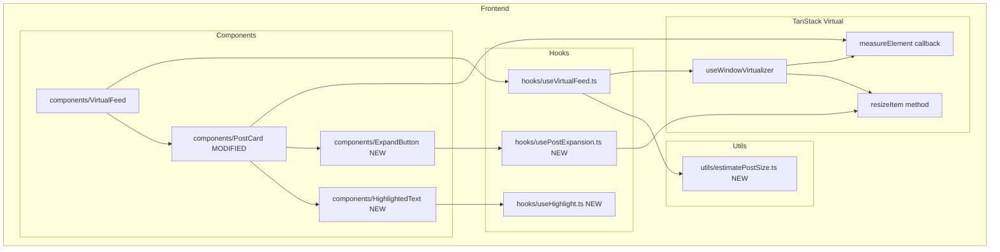
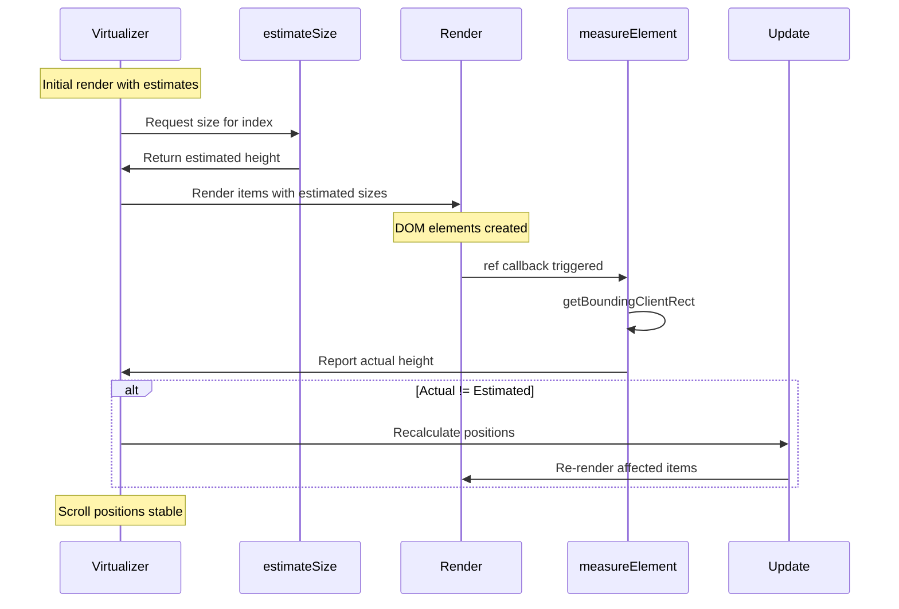
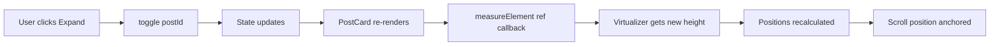

# Phase 4: Dynamic Sizes and Real-World Optimization - Detailed Plan

## Overview

**Goal:** The most challenging phase - correctly handling "jumping" content and dynamic height changes.

**Dependencies:** Completed Phase 3, `@tanstack/react-virtual` already installed

> ⚠️ **Important: Phase 3 PostCard Issue**
>
> Phase 3 PostCard has `forwardRef` but it's **not properly connected** for measurement:
> 1. VirtualFeed wrapper div has `height: ${virtualItem.size}px` - forces fixed height!
> 2. PostCard ref isn't passed to `virtualizer.measureElement`
> 3. Virtualizer has no `measureElement` configuration
>
> Phase 4 must fix this by removing the fixed height wrapper and properly connecting refs.

**Decisions Made:**

- **Dynamic Sizing Strategy:** `measureElement` with smart `estimateSize` based on content analysis
- **Expand/Collapse:** Full content display with Collapse button, instant resize
- **Search Highlighting:** Included in Phase 4 using text matching with CSS highlighting
- **Image Loading:** Simple aspect-ratio placeholders (no blur effect)
- **Performance Testing:** Chrome DevTools Performance tab (manual testing)
- **Resize Handling:** Automatic via TanStack Virtual's built-in measurement

---

## Architecture Diagram



---

## Dynamic Sizing Mechanism



### Key Concepts

1. **estimateSize:** Initial guess based on content analysis (text length, attachments)
2. **measureElement:** Actual DOM measurement after render
3. **Automatic Recalculation:** Virtualizer adjusts positions when measurements differ
4. **Scroll Anchoring:** Browser maintains scroll position during resize

---

## Current Implementation Analysis

Before making changes, let's understand the **current implementation issues**:

### PostCard.tsx (Current - WRONG)
```tsx
// Line 8-12: NOT using forwardRef - just passing ref as a regular prop
export const PostCard = ({
  ref,
  post,
}: PostCardProps & {ref?: React.RefObject<HTMLDivElement | null}) => {
  return (
    <Card
      ref={ref}
      // Line 18: ❌ FIXED HEIGHT - forces all cards to 400px!
      style={{height: '400px', display: 'flex', flexDirection: 'column'}}
    >
      // Line 24: content truncated with line-clamp-3
      <p className="mb-3 line-clamp-3 ...">
```

### VirtualFeed.tsx (Current - WRONG)
```tsx
// Lines 99-112
<div
  data-index={virtualItem.index}
  style={{
    // ...
    height: `${virtualItem.size}px`,  // ❌ Forces estimated size on wrapper!
    // ...
  }}
>
  {/* ❌ ref is NOT passed to PostCard! */}
  {post && <PostCard post={post} />}
</div>
```

### useVirtualFeed.ts (Current - WRONG)
```tsx
// Lines 79-84
const virtualizer = useWindowVirtualizer({
  count: items.length,
  estimateSize: index => estimateSize(index, items[index]),
  overscan,
  scrollMargin,
  // ❌ NO measureElement configuration!
});
```

---

## Implementation Steps

### Step 1: Create Post Expansion State Hook

**Files to create:**

- `frontend/src/hooks/usePostExpansion.ts` - Manages expanded state per post

#### `frontend/src/hooks/usePostExpansion.ts`

```typescript
import { useCallback, useState } from 'react';

/**
 * Manages expansion state for posts in the virtualized list.
 * Uses post IDs to track which posts are expanded.
 */
export function usePostExpansion() {
  const [expandedPosts, setExpandedPosts] = useState<Set<string>>(new Set());

  const isExpanded = useCallback(
    (postId: string) => expandedPosts.has(postId),
    [expandedPosts]
  );

  const toggle = useCallback((postId: string) => {
    setExpandedPosts((prev) => {
      const next = new Set(prev);
      if (next.has(postId)) {
        next.delete(postId);
      } else {
        next.add(postId);
      }
      return next;
    });
  }, []);

  const expand = useCallback((postId: string) => {
    setExpandedPosts((prev) => {
      const next = new Set(prev);
      next.add(postId);
      return next;
    });
  }, []);

  const collapse = useCallback((postId: string) => {
    setExpandedPosts((prev) => {
      const next = new Set(prev);
      next.delete(postId);
      return next;
    });
  }, []);

  const reset = useCallback(() => {
    setExpandedPosts(new Set());
  }, []);

  return {
    expandedPosts,
    isExpanded,
    toggle,
    expand,
    collapse,
    reset,
  };
}
```

---

### Step 2: Create Estimate Size Utility

**Files to create:**

- `frontend/src/utils/estimatePostSize.ts` - Smart height estimation

#### `frontend/src/utils/estimatePostSize.ts`

```typescript
import { Post } from '../types/post';

// Constants for size estimation
const BASE_HEIGHT = 120; // Card padding, title, date
const LINE_HEIGHT = 24; // Approximate line height for text
const CHARS_PER_LINE = 80; // Approximate characters per line
const MAX_COLLAPSED_LINES = 4; // Max lines when collapsed
const ATTACHMENT_HEIGHT = 300; // Default attachment height
const ATTACHMENT_GAP = 12; // Gap between attachments
const EXPANDED_BONUS = 60; // Extra height for expand button area

/**
 * Estimates the height of a post card based on its content.
 * This is used by the virtualizer for initial positioning before measureElement.
 */
export function estimatePostHeight(post: Post, isExpanded: boolean = false): number {
  let height = BASE_HEIGHT;

  // Calculate text height
  const textLength = post.content.length;
  const lines = Math.ceil(textLength / CHARS_PER_LINE);

  if (isExpanded) {
    // Full text when expanded
    height += lines * LINE_HEIGHT;
    height += EXPANDED_BONUS;
  } else {
    // Clamped to max lines when collapsed
    const visibleLines = Math.min(lines, MAX_COLLAPSED_LINES);
    height += visibleLines * LINE_HEIGHT;
  }

  // Add attachment heights using aspect ratio
  if (post.attachments && post.attachments.length > 0) {
    // Assume full width container, calculate based on aspect ratio
    // For a typical mobile-ish feed width of ~600px
    const containerWidth = 600;

    post.attachments.forEach((attachment) => {
      // aspectRatio = width / height, so height = width / aspectRatio
      const attachmentHeight = containerWidth / attachment.aspectRatio;
      height += attachmentHeight + ATTACHMENT_GAP;
    });
  }

  return height;
}

/**
 * Creates an estimateSize function for the virtualizer.
 * This closure has access to the current items and expansion state.
 */
export function createEstimateSizeFunction(
  items: Post[],
  getIsExpanded: (postId: string) => boolean
) {
  return (index: number): number => {
    const post = items[index];
    if (!post) return 200; // Fallback

    const expanded = getIsExpanded(post.id);
    return estimatePostHeight(post, expanded);
  };
}
```

---

### Step 3: Create Search Highlighting Utility

**Files to create:**

- `frontend/src/utils/highlightText.ts` - Text highlighting logic
- `frontend/src/components/HighlightedText/HighlightedText.tsx` - Highlight component

#### `frontend/src/utils/highlightText.ts`

```typescript
import { ReactNode, createElement } from 'react';

interface HighlightMatch {
  text: string;
  isHighlight: boolean;
}

/**
 * Splits text into segments, marking which ones match the search query.
 * Case-insensitive matching.
 */
export function splitBySearchQuery(
  text: string,
  searchQuery: string
): HighlightMatch[] {
  if (!searchQuery.trim()) {
    return [{ text, isHighlight: false }];
  }

  const segments: HighlightMatch[] = [];
  const lowerText = text.toLowerCase();
  const lowerQuery = searchQuery.toLowerCase();
  let lastIndex = 0;

  let index = lowerText.indexOf(lowerQuery);
  while (index !== -1) {
    // Add non-matching segment before
    if (index > lastIndex) {
      segments.push({
        text: text.slice(lastIndex, index),
        isHighlight: false,
      });
    }

    // Add matching segment (preserve original case)
    segments.push({
      text: text.slice(index, index + searchQuery.length),
      isHighlight: true,
    });

    lastIndex = index + searchQuery.length;
    index = lowerText.indexOf(lowerQuery, lastIndex);
  }

  // Add remaining non-matching segment
  if (lastIndex < text.length) {
    segments.push({
      text: text.slice(lastIndex),
      isHighlight: false,
    });
  }

  return segments;
}

/**
 * Renders text with search matches highlighted.
 * Returns an array of React nodes.
 */
export function renderHighlightedText(
  text: string,
  searchQuery: string,
  highlightClassName: string = 'bg-yellow-200 dark:bg-yellow-700 rounded px-0.5'
): ReactNode[] {
  const segments = splitBySearchQuery(text, searchQuery);

  return segments.map((segment, index) => {
    if (segment.isHighlight) {
      return createElement(
        'mark',
        {
          key: index,
          className: highlightClassName,
        },
        segment.text
      );
    }
    return segment.text;
  });
}
```

#### `frontend/src/components/HighlightedText/HighlightedText.tsx`

```typescript
import { memo } from 'react';
import { renderHighlightedText } from '../../utils/highlightText';

interface HighlightedTextProps {
  text: string;
  searchQuery: string;
  className?: string;
  highlightClassName?: string;
}

/**
 * Renders text with search query matches highlighted.
 * Memoized to prevent unnecessary re-renders.
 */
export const HighlightedText = memo(function HighlightedText({
  text,
  searchQuery,
  className,
  highlightClassName,
}: HighlightedTextProps) {
  const content = renderHighlightedText(text, searchQuery, highlightClassName);

  return <span className={className}>{content}</span>;
});
```

---

### Step 4: Create Expand Button Component

**Files to create:**

- `frontend/src/components/ExpandButton/ExpandButton.tsx` - Expand/Collapse button

#### `frontend/src/components/ExpandButton/ExpandButton.tsx`

```typescript
import { memo } from 'react';
import { Button } from 'flowbite-react';
import { HiChevronDown, HiChevronUp } from 'react-icons/hi';

interface ExpandButtonProps {
  isExpanded: boolean;
  onToggle: () => void;
  collapsedLines: number;
  totalLines: number;
}

/**
 * Button to expand/collapse long post content.
 * Only shows when content exceeds collapsed line limit.
 */
export const ExpandButton = memo(function ExpandButton({
  isExpanded,
  onToggle,
  collapsedLines,
  totalLines,
}: ExpandButtonProps) {
  // Don't show button if content fits in collapsed view
  if (totalLines <= collapsedLines) {
    return null;
  }

  return (
    <Button
      color="light"
      size="xs"
      onClick={onToggle}
      className="mt-2 w-full"
      pill
    >
      {isExpanded ? (
        <>
          <HiChevronUp className="mr-1 h-4 w-4" />
          Show less
        </>
      ) : (
        <>
          <HiChevronDown className="mr-1 h-4 w-4" />
          Show more
        </>
      )}
    </Button>
  );
});
```

---

### Step 5: Update PostCard Component

**Files to modify:** `frontend/src/components/PostCard/PostCard.tsx`

The PostCard needs to:
1. Support expand/collapse functionality
2. Show highlighted search terms
3. Work with measureElement

#### `frontend/src/components/PostCard/PostCard.tsx`

```typescript
import { forwardRef, useCallback, useMemo } from 'react';
import { Card } from 'flowbite-react';
import { Post } from '../../types/post';
import { HighlightedText } from '../HighlightedText/HighlightedText';
import { ExpandButton } from '../ExpandButton/ExpandButton';

interface PostCardProps {
  post: Post;
  isExpanded: boolean;
  onToggleExpand: () => void;
  searchQuery?: string;
}

const CHARS_PER_LINE = 80;
const MAX_COLLAPSED_LINES = 4;

/**
 * Post card component with dynamic height support.
 * Uses forwardRef for measureElement integration.
 */
export const PostCard = forwardRef<HTMLDivElement, PostCardProps>(
  ({ post, isExpanded, onToggleExpand, searchQuery = '' }, ref) => {
    // Calculate line count for expand button visibility
    const totalLines = useMemo(
      () => Math.ceil(post.content.length / CHARS_PER_LINE),
      [post.content]
    );

    // Content class based on expansion state
    const contentClassName = isExpanded
      ? 'mb-3 text-gray-700 dark:text-gray-300'
      : 'mb-3 text-gray-700 dark:text-gray-300 line-clamp-4';

    return (
      <Card
        ref={ref}
        className="transition-shadow hover:shadow-md"
        data-post-id={post.id}
      >
        {/* Title with optional highlighting */}
        <h3 className="mb-2 text-lg font-semibold text-gray-900 dark:text-white">
          {searchQuery ? (
            <HighlightedText
              text={post.title}
              searchQuery={searchQuery}
            />
          ) : (
            post.title
          )}
        </h3>

        {/* Content with optional highlighting and expand/collapse */}
        <div className={contentClassName}>
          {searchQuery ? (
            <HighlightedText
              text={post.content}
              searchQuery={searchQuery}
            />
          ) : (
            post.content
          )}
        </div>

        {/* Expand/Collapse Button */}
        <ExpandButton
          isExpanded={isExpanded}
          onToggle={onToggleExpand}
          collapsedLines={MAX_COLLAPSED_LINES}
          totalLines={totalLines}
        />

        {/* Attachments with aspect-ratio placeholders */}
        {post.attachments && post.attachments.length > 0 && (
          <div className="mt-3 space-y-3">
            {post.attachments.map((attachment, index) => (
              <div
                key={index}
                className="overflow-hidden rounded-lg bg-gray-100 dark:bg-gray-700"
                style={{ aspectRatio: attachment.aspectRatio }}
              >
                {attachment.type === 'image' ? (
                  
                ) : (
                  <video
                    src={attachment.url}
                    className="h-full w-full object-cover"
                    controls
                    preload="metadata"
                  />
                )}
              </div>
            ))}
          </div>
        )}

        {/* Date */}
        <time className="mt-3 block text-sm text-gray-500 dark:text-gray-400">
          {new Date(post.createdAt).toLocaleDateString()}
        </time>
      </Card>
    );
  }
);

PostCard.displayName = 'PostCard';
```

---

### Step 6: Update useVirtualFeed Hook

**Files to modify:** `frontend/src/hooks/useVirtualFeed.ts`

The hook needs to:
1. Add `measureElement` configuration
2. Support dynamic `estimateSize` function
3. Expose methods for manual resize triggering

#### `frontend/src/hooks/useVirtualFeed.ts`

```typescript
import { useEffect, useCallback, useRef } from 'react';
import { useWindowVirtualizer } from '@tanstack/react-virtual';
import { useInfiniteQuery } from '@tanstack/react-query';
import { Post } from '../types/post';

interface UseVirtualFeedOptions {
  // Query options
  queryKey: unknown[];
  queryFn: (context: { pageParam?: string }) => Promise<{
    items: Post[];
    nextCursor: string | null;
    hasMore: boolean;
  }>;

  // Virtual options
  estimateSize: (index: number) => number;
  overscan?: number;
}

interface UseVirtualFeedReturn {
  // Virtual data
  virtualItems: ReturnType<ReturnType<typeof useWindowVirtualizer>['getVirtualItems']>;
  totalSize: number;
  scrollMargin: number;

  // Query data
  items: Post[];
  isLoading: boolean;
  isError: boolean;
  error: unknown;
  isFetchingNextPage: boolean;
  hasNextPage: boolean;

  // Actions
  fetchNextPage: () => void;
  scrollToTop: () => void;
  measureElement: (el: HTMLElement | null) => void;
  resizeItem: (index: number, size: number) => void;
}

const DEFAULT_OVERSCAN = 5;

export function useVirtualFeed({
  queryKey,
  queryFn,
  estimateSize,
  overscan = DEFAULT_OVERSCAN,
}: UseVirtualFeedOptions): UseVirtualFeedReturn {
  const listRef = useRef<HTMLDivElement>(null);

  // Infinite query for data
  const {
    data,
    isLoading,
    isError,
    error,
    fetchNextPage,
    isFetchingNextPage,
    hasNextPage,
  } = useInfiniteQuery({
    queryKey,
    queryFn,
    initialPageParam: undefined as string | undefined,
    getNextPageParam: (lastPage) => {
      if (!lastPage.hasMore || !lastPage.nextCursor) {
        return undefined;
      }
      return lastPage.nextCursor;
    },
    refetchOnWindowFocus: false,
    staleTime: 1000 * 60 * 5,
  });

  // Flatten pages into single array
  const items = data?.pages.flatMap((page) => page.items) ?? [];

  // Window scroll virtualizer with dynamic sizing
  const virtualizer = useWindowVirtualizer({
    count: items.length,
    estimateSize,
    overscan,
    scrollMargin: listRef.current?.offsetTop ?? 0,
    // Measure element using getBoundingClientRect
    measureElement: (el) => {
      if (!el) return 0;
      return el.getBoundingClientRect().height;
    },
  });

  // Get virtual items
  const virtualItems = virtualizer.getVirtualItems();
  const totalSize = virtualizer.getTotalSize();

  // Auto-fetch when near bottom
  const lastItem = virtualItems[virtualItems.length - 1];

  useEffect(() => {
    if (!lastItem) return;

    // Fetch more when user is within 10 items from the end
    const itemsFromEnd = items.length - lastItem.index;

    if (itemsFromEnd < 10 && hasNextPage && !isFetchingNextPage) {
      fetchNextPage();
    }
  }, [lastItem, items.length, hasNextPage, isFetchingNextPage, fetchNextPage]);

  // Scroll to top helper
  const scrollToTop = useCallback(() => {
    window.scrollTo({ top: 0, behavior: 'smooth' });
  }, []);

  return {
    virtualItems,
    totalSize,
    scrollMargin: listRef.current?.offsetTop ?? 0,
    items,
    isLoading,
    isError,
    error,
    isFetchingNextPage,
    hasNextPage,
    fetchNextPage,
    scrollToTop,
    measureElement: virtualizer.measureElement,
    resizeItem: virtualizer.resizeItem,
  };
}
```

---

### Step 7: Update VirtualFeed Component

**Files to modify:** `frontend/src/components/VirtualFeed/VirtualFeed.tsx`

Integrate all the new features: expand/collapse, highlighting, and dynamic sizing.

#### `frontend/src/components/VirtualFeed/VirtualFeed.tsx`

```typescript
import { useState, useEffect, useRef, useCallback, useMemo } from 'react';
import { Alert } from 'flowbite-react';
import { HiInformationCircle } from 'react-icons/hi';
import { useDebounce } from '../../hooks/useDebounce';
import { usePostExpansion } from '../../hooks/usePostExpansion';
import { useVirtualFeed } from '../../hooks/useVirtualFeed';
import { postsApi } from '../../api/posts';
import { PostCard } from '../PostCard/PostCard';
import { SearchInput } from '../SearchInput/SearchInput';
import { LoadingIndicator } from '../LoadingIndicator/LoadingIndicator';
import { PostSkeleton } from '../Skeleton/PostSkeleton';
import { createEstimateSizeFunction } from '../../utils/estimatePostSize';
import { Post } from '../../types/post';

const SEARCH_DEBOUNCE_MS = 500;

export const VirtualFeed = () => {
  const [searchInput, setSearchInput] = useState('');
  const debouncedSearch = useDebounce(searchInput, SEARCH_DEBOUNCE_MS);
  const listRef = useRef<HTMLDivElement>(null);

  // Expansion state management
  const { isExpanded, toggle } = usePostExpansion();

  // Memoized estimate size function that considers expansion state
  const estimateSize = useCallback(
    (index: number) => {
      // This will be called with current items from closure
      return 400; // Base estimate, measureElement will correct it
    },
    []
  );

  const {
    virtualItems,
    totalSize,
    scrollMargin,
    items: posts,
    isLoading,
    isError,
    error,
    isFetchingNextPage,
    hasNextPage,
    scrollToTop,
    measureElement,
  } = useVirtualFeed({
    queryKey: ['posts', { search: debouncedSearch }],
    queryFn: ({ pageParam }) =>
      postsApi.getPosts({
        limit: 20,
        cursor: pageParam,
        search: debouncedSearch || undefined,
      }),
    estimateSize,
    overscan: 5,
  });

  // Create a stable estimate function that has access to current posts
  const getEstimatedSize = useMemo(() => {
    return createEstimateSizeFunction(posts, isExpanded);
  }, [posts, isExpanded]);

  // Scroll to top on search change
  useEffect(() => {
    scrollToTop();
  }, [debouncedSearch, scrollToTop]);

  // Handle expand toggle - need to remeasure the item
  const handleToggleExpand = useCallback(
    (postId: string) => {
      toggle(postId);

      // Find the index of the post
      const index = posts.findIndex((p) => p.id === postId);
      if (index !== -1) {
        // The virtualizer will automatically remeasure on next render
        // We can force immediate update by calling resizeItem if needed
      }
    },
    [toggle, posts]
  );

  return (
    <div className="mx-auto max-w-2xl px-4 py-4">
      {/* Search Header */}
      <div className="mb-6">
        <SearchInput
          value={searchInput}
          onChange={setSearchInput}
          placeholder="Search posts by title or content..."
        />
      </div>

      {/* Error State */}
      {isError && (
        <Alert
          color="failure"
          icon={HiInformationCircle}
          className="mb-4"
        >
          <span className="font-medium">Error loading posts!</span>{' '}
          {error instanceof Error ? error.message : 'Please try again later.'}
        </Alert>
      )}

      {/* Initial Loading State */}
      {isLoading && (
        <div className="space-y-4">
          {Array.from({ length: 5 }).map((_, i) => (
            <PostSkeleton key={i} />
          ))}
        </div>
      )}

      {/* Virtualized List - Window Scroll with Dynamic Heights */}
      {!isLoading && (
        <>
          <div ref={listRef}>
            {/* Phantom container for scrollbar */}
            <div
              style={{
                height: `${totalSize}px`,
                width: '100%',
                position: 'relative',
              }}
            >
              {virtualItems.map((virtualItem) => {
                const post = posts[virtualItem.index];

                return (
                  <div
                    key={post?.id ?? virtualItem.key}
                    data-index={virtualItem.index}
                    ref={measureElement} // ✅ Connect measureElement for dynamic height
                    style={{
                      position: 'absolute',
                      top: 0,
                      left: 0,
                      width: '100%',
                      // ⚠️ NO height property - let measureElement determine it
                      transform: `translateY(${virtualItem.start - scrollMargin}px)`,
                    }}
                  >
                    {post && (
                      <PostCard
                        post={post}
                        isExpanded={isExpanded(post.id)}
                        onToggleExpand={() => handleToggleExpand(post.id)}
                        searchQuery={debouncedSearch}
                      />
                    )}
                  </div>
                );
              })}
            </div>
          </div>

          {/* Loading indicator at bottom */}
          {isFetchingNextPage && (
            <div className="py-4">
              <LoadingIndicator />
            </div>
          )}

          {/* End of list indicator */}
          {!isFetchingNextPage && !hasNextPage && posts.length > 0 && (
            <div className="py-4 text-center text-gray-500 dark:text-gray-400">
              You have reached the end of the feed
            </div>
          )}
        </>
      )}

      {/* Empty State */}
      {!isLoading && posts.length === 0 && !isError && (
        <div className="py-12 text-center">
          <p className="text-gray-500 dark:text-gray-400">
            {debouncedSearch
              ? 'No posts found matching your search.'
              : 'No posts available.'}
          </p>
        </div>
      )}
    </div>
  );
};
```

---

## File Structure After Phase 4

```
frontend/
├── src/
│   ├── api/
│   │   ├── client.ts
│   │   └── posts.ts
│   ├── hooks/
│   │   ├── useDebounce.ts
│   │   ├── useInfinitePosts.ts
│   │   ├── useVirtualFeed.ts       # MODIFIED: measureElement support
│   │   └── usePostExpansion.ts     # NEW: Expansion state
│   ├── utils/
│   │   ├── estimatePostSize.ts     # NEW: Size estimation
│   │   └── highlightText.ts        # NEW: Search highlighting
│   ├── types/
│   │   ├── api.ts
│   │   └── post.ts
│   ├── components/
│   │   ├── VirtualFeed/
│   │   │   └── VirtualFeed.tsx     # MODIFIED: All integrations
│   │   ├── PostCard/
│   │   │   └── PostCard.tsx        # MODIFIED: Expand + Highlight
│   │   ├── ExpandButton/
│   │   │   └── ExpandButton.tsx    # NEW
│   │   ├── HighlightedText/
│   │   │   └── HighlightedText.tsx # NEW
│   │   ├── SearchInput/
│   │   │   └── SearchInput.tsx
│   │   ├── LoadingIndicator/
│   │   │   └── LoadingIndicator.tsx
│   │   └── Skeleton/
│   │       └── PostSkeleton.tsx
│   ├── App.tsx
│   ├── main.tsx
│   └── index.css
├── .env
└── package.json
```

---

## Key Implementation Details

### 1. Dynamic Sizing Strategy

| Phase | estimateSize | measureElement | Result |
|-------|--------------|----------------|--------|
| Phase 3 | Fixed `() => 400` | Not used | Constant height cards |
| Phase 4 | Smart estimation based on content | `getBoundingClientRect()` | Accurate dynamic heights |

### 2. Expand/Collapse Flow



### 3. Search Highlighting

| Input | Output |
|-------|--------|
| `text="Hello world"`, `query="world"` | `Hello <mark>world</mark>` |
| `text="Hello World"`, `query="world"` | `Hello <mark>World</mark>` (case preserved) |
| `text="Hello"`, `query=""` | `Hello` (no highlight) |

### 4. Performance Optimizations

| Technique | Implementation |
|-----------|----------------|
| `memo` on components | `PostCard`, `ExpandButton`, `HighlightedText` |
| `useCallback` for handlers | `toggle`, `handleToggleExpand` |
| `useMemo` for calculations | `totalLines`, `getEstimatedSize` |
| Lazy image loading | `loading="lazy"` on images |
| Video preload | `preload="metadata"` on videos |

---

## Definition of Done Checklist

- [ ] **usePostExpansion hook:** Manages expanded state by post ID
- [ ] **estimatePostSize utility:** Smart estimation based on content
- [ ] **highlightText utility:** Splits and marks search matches
- [ ] **HighlightedText component:** Renders highlighted text with memo
- [ ] **ExpandButton component:** Shows/hides based on content length
- [ ] **PostCard updated:** Expand, collapse, highlight support with forwardRef
- [ ] **useVirtualFeed updated:** measureElement configuration
- [ ] **VirtualFeed updated:** All integrations working together
- [ ] **No layout shift:** Scroll position stable when images load
- [ ] **Expand recalculation:** Positions update instantly on expand/collapse
- [ ] **Search highlighting:** Terms highlighted in title and content
- [ ] **Performance validated:** 2-minute scroll test, FPS > 50, no memory leaks

---

## Testing the Implementation

### Manual Testing Scenarios

| Test | Steps | Expected Result |
|------|-------|-----------------|
| **Dynamic sizing** | Scroll through feed | Cards have different heights based on content |
| **Expand** | Click "Show more" on long post | Full content shown, positions recalculate |
| **Collapse** | Click "Show less" | Content clamped, positions recalculate |
| **Search highlight** | Type in search box | Matching terms highlighted in yellow |
| **Image loading** | Scroll to post with image | No scroll jump when image loads |
| **Fast scroll** | Scroll rapidly for 2 min | No white spots, smooth scrolling |

### Performance Testing with Chrome DevTools

1. **Open DevTools:** F12 → Performance tab
2. **Record:** Click Record, scroll through feed for 30 seconds
3. **Analyze:**
   - FPS should stay above 50 (green bar)
   - No long tasks (>50ms) in main thread
   - Layout shifts should be minimal

4. **Memory Check:**
   - Open Memory tab
   - Take heap snapshot before scrolling
   - Scroll for 2 minutes
   - Take heap snapshot after
   - Compare - memory should not grow significantly

### Console Checks

```javascript
// Check DOM node count (should be ~10-15)
document.querySelectorAll('[data-index]').length

// Check for memory leaks (run before and after scroll)
performance.memory?.usedJSHeapSize

// Verify virtualizer is working
// Should see only visible items + overscan
```

---

## Common Issues & Solutions

### Issue: Scroll jumps when expanding

**Solution:** Virtualizer handles this automatically via `measureElement` - ensure `data-index` attribute is set

### Issue: Highlighted text breaks layout

**Solution:** Use `display: inline` for `<mark>` elements, not block

### Issue: Expand button causes double-render

**Solution:** Ensure `toggle` function is memoized with `useCallback`

### Issue: White spots during fast scroll with dynamic sizes

**Solution:** Increase `overscan` to 7-10 to pre-render more items off-screen

### Issue: Images still cause layout shift

**Solution:** Verify `aspectRatio` is correctly set in data and applied to container

---

## Notes for Future Enhancements

Phase 4 completes the core virtualization implementation. Potential future work:

1. **Scroll Restoration:** Remember scroll position on browser back/forward
2. **Blur Placeholders:** Add blurred thumbnail placeholders for images
3. **Virtualized Grid:** Multi-column layout for wider viewports
4. **Prefetching:** Pre-load next page data before user scrolls to bottom
5. **Analytics:** Track scroll depth and engagement

---

## Resources

- [TanStack Virtual Dynamic Sizes](https://tanstack.com/virtual/latest/docs/guide/dynamic-sizes)
- [measureElement API](https://tanstack.com/virtual/latest/docs/api/virtualizer#measureelement)
- [ResizeObserver MDN](https://developer.mozilla.org/en-US/docs/Web/API/ResizeObserver)
- [CSS aspect-ratio](https://developer.mozilla.org/en-US/docs/Web/CSS/aspect-ratio)
- [Chrome DevTools Performance](https://developer.chrome.com/docs/devtools/performance/)
