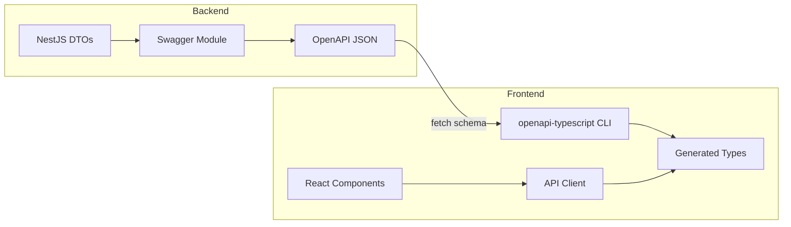

# План рефакторинга: Автоматическая генерация типов API

## Обзор

**Цель**: Перейти от ручного определения типов к автоматической генерации из OpenAPI схемы бэкенда.

**Выбранный инструмент**: [openapi-typescript](https://openapi-ts.pages.dev/openapi-typescript/)

**Причины выбора**:

- Легковесный, генерирует только TypeScript типы
- Не требует изменений в существующем API клиенте
- Поддержка OpenAPI 3.0/3.1
- Можно использовать с текущим axios клиентом

---

## Текущее состояние

### Фронтенд - вручную определённые типы

```
frontend/src/types/
├── api.ts        # PaginatedResponse, GetPostsParams, etc.
└── post.ts       # Post, Attachment
```

### Бэкенд - NestJS с Swagger

```
backend/src/posts/dto/
├── get-posts.dto.ts       # GetPostsDto
├── get-new-count.dto.ts   # GetNewCountDto
├── post-item.dto.ts       # PostItemDto, AttachmentDto
└── post-response.dto.ts   # PostResponseDto
```

**Swagger endpoint**: `http://localhost:3000/api/docs-json`

---

## Архитектура решения



---

## Этапы реализации

### Этап 1: Установка зависимостей

**Задача**: Добавить openapi-typescript в devDependencies

```bash
npm install -D openapi-typescript
```

**Файлы для изменения**: [`package.json`](package.json)

---

### Этап 2: Добавление npm скрипта для генерации

**Задача**: Создать скрипт для запуска генерации типов

Добавить в [`package.json`](package.json):

```json
{
  "scripts": {
    "generate:types": "openapi-typescript http://localhost:3000/api/docs-json -o src/types/generated/api.d.ts"
  }
}
```

---

### Этап 3: Обновление структуры папки types

**Текущая структура**:

```
src/types/
├── api.ts
└── post.ts
```

**Новая структура**:

```
src/types/
├── generated/
│   └── api.d.ts        # Автогенерируемые типы (коммитятся в репозиторий)
└── index.ts            # Реэкспорт удобных алиасов
```

---

### Этап 4: Создание файла с алиасами типов

**Задача**: Создать удобные алиасы для сгенерированных типов

Файл: `src/types/index.ts`

```typescript
import type { components, paths } from './generated/api';

// Response types
export type Post = components['schemas']['PostItemDto'];
export type Attachment = components['schemas']['AttachmentDto'];
export type PostResponse = components['schemas']['PostResponseDto'];
export type NewPostsCountResponse = {
  count: number;
  latestCursor: string | null;
};

// Request types
export type GetPostsParams = components['schemas']['GetPostsDto'];
export type GetNewCountParams = components['schemas']['GetNewCountDto'];

// Generic types
export interface PaginatedResponse<T> {
  items: T[];
  nextCursor: string | null;
  hasMore: boolean;
}

// Path types for type-safe API client (future enhancement)
export type ApiPaths = paths;
```

---

### Этап 5: Обновление API клиента

**Задача**: Обновить импорты в [`src/api/posts.ts`](src/api/posts.ts)

**До**:

```typescript
import type {
  PostsResponse,
  GetPostsParams,
  NewPostsCountResponse,
  GetNewCountParams,
} from '../types/api';
```

**После**:

```typescript
import type {
  PostResponse,
  GetPostsParams,
  NewPostsCountResponse,
  GetNewCountParams,
} from '../types';
```

---

### Этап 6: Удаление старых файлов типов

**Задача**: Удалить или переместить устаревшие файлы

Файлы для удаления:

- [`src/types/api.ts`](src/types/api.ts)
- [`src/types/post.ts`](src/types/post.ts)

---

### Этап 7: Стратегия для сгенерированных файлов

**Решение**: Коммитить сгенерированные файлы в репозиторий.

**Плюсы**:

- Простота CI/CD
- Типы доступны без запуска бэкенда
- История изменений типов в git

**Минусы**:

- Возможные merge conflicts при изменении схемы

Файл `.gitignore` не требует изменений — сгенерированные файлы будут коммититься.

---

## Workflow для разработчиков

### При изменении схемы API на бэкенде

**Шаг 1**: Запустить бэкенд (в отдельном терминале)

```powershell
cd ..\backend
npm run start:dev
```

**Шаг 2**: Сгенерировать типы на фронтенде (в терминале фронтенда)

```powershell
npm run generate:types
```

**Шаг 3**: Проверить TypeScript ошибки

```powershell
npm run ts
```

---

## Интеграция с CI/CD (будущее улучшение)

Можно добавить проверку актуальности типов в pre-commit hook или CI:

```bash
npm run generate:types -- --check
```

---

## Файловая карта изменений

| Файл | Действие | Описание |
|------|----------|----------|
| `package.json` | Изменить | Добавить зависимость и скрипт |
| `src/types/generated/api.d.ts` | Создать | Автогенерируемые типы |
| `src/types/index.ts` | Создать | Алиасы типов |
| `src/types/api.ts` | Удалить | Устаревший файл |
| `src/types/post.ts` | Удалить | Устаревший файл |
| `src/api/posts.ts` | Изменить | Обновить импорты |
| `src/api/client.ts` | Без изменений | Оставить как есть |

---

## Риски и митигация

| Риск | Вероятность | Митигация |
|------|-------------|-----------|
| Бэкенд не запущен при генерации | Средняя | Документировать workflow, добавить ошибку в скрипт |
| Схема Swagger неполная | Низкая | Бэкенд уже использует @nestjs/swagger декораторы |
| Breaking changes в типах | Средняя | Использовать TypeScript компилятор для выявления |

---

## Итоговая структура todo

```markdown
[ ] Установить openapi-typescript в frontend
[ ] Добавить npm скрипт generate:types в package.json
[ ] Создать директорию src/types/generated/
[ ] Запустить первичную генерацию типов
[ ] Создать src/types/index.ts с алиасами
[ ] Обновить импорты в src/api/posts.ts
[ ] Проверить TypeScript ошибки npm run ts
[ ] Удалить src/types/api.ts и src/types/post.ts
[ ] Протестировать работу приложения npm run dev
[ ] Обновить документацию проекта
```
