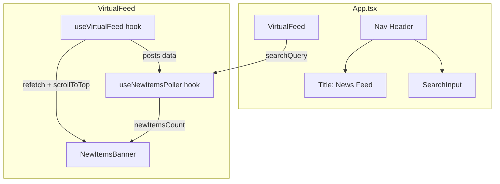
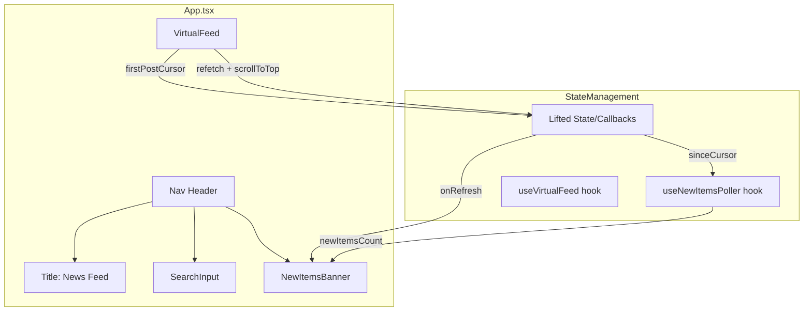

# Refactor Plan: Move NewItemsBanner to Nav Header

## Overview

Move the `NewItemsBanner` component from inside `VirtualFeed` to the navigation header (right corner), while keeping the title "News Feed" and `SearchInput` positions unchanged.

---

## Current Implementation Analysis

### Component Location and Data Flow



### Current NewItemsBanner Integration

**File:** [`src/components/VirtualFeed/index.tsx`](src/components/VirtualFeed/index.tsx)

| Aspect | Details |
|--------|---------|
| **Location** | Lines 141-147, rendered above the virtualized list |
| **Props received** | `count` from `useNewItemsPoller`, `onRefresh` callback |
| **Visibility condition** | `!isLoading && newItemsCount > 0` |
| **Styling** | `sticky top-0 z-50` - sticks below the nav header |

### Dependencies Required by NewItemsBanner

1. **`newItemsCount`** - from [`useNewItemsPoller`](src/hooks/useNewItemsPoller.ts) hook
   - Requires `sinceCursor` - cursor of the first post in the current list
   - Requires `searchQuery` - current search filter
   - Requires `pollingInterval` - 30000ms

2. **`onRefresh` callback** - needs two functions from `useVirtualFeed`:
   - `refetch()` - refetch posts data
   - `scrollToTop()` - scroll window to top

### Current Nav Header Structure

**File:** [`src/App.tsx`](src/App.tsx:14-30)

```tsx
<nav className="sticky top-0 z-50 ...">
  <div className="mx-auto max-w-2xl px-4 py-3">
    <div className="flex items-center gap-4">
      <span className="shrink-0 ...">News Feed</span>
      <div className="flex-1">
        <SearchInput ... />
      </div>
    </div>
  </div>
</nav>
```

**Current layout:** Title + SearchInput (flex-1) with gap-4

---

## Proposed Changes

### Target Layout

```
+--------------------------------------------------+
| News Feed | [SearchInput......] | [NewItemsBanner] |
+--------------------------------------------------+
```

The NewItemsBanner will appear in the right corner of the nav header when new items are available.

### Architecture Change



---

## Implementation Strategy

### Option A: Lift State to App.tsx (Recommended)

**Pros:**
- Clean separation of concerns
- NewItemsBanner belongs in the header context
- No prop drilling through intermediate components

**Cons:**
- Requires refactoring VirtualFeed to expose necessary data
- More changes across files

**Changes Required:**

1. **Modify `VirtualFeed`** to expose:
   - `firstPostCursor` via callback or ref
   - `refetch` and `scrollToTop` functions

2. **Update `App.tsx`** to:
   - Call `useNewItemsPoller` directly
   - Render `NewItemsBanner` in the nav header
   - Pass required props to VirtualFeed for callback wiring

### Option B: Use React Context

**Pros:**
- No need to change VirtualFeed props interface significantly
- Can share state between distant components

**Cons:**
- Adds complexity with context provider
- Overkill for this simple case

### Option C: Render NewItemsBanner in App.tsx, Keep Polling in VirtualFeed

**Pros:**
- Minimal changes to data flow
- VirtualFeed remains self-contained for data fetching

**Cons:**
- Requires callback props from VirtualFeed to App
- Slightly unusual data flow pattern

---

## Detailed File Changes (Option A - Recommended)

### 1. [`src/App.tsx`](src/App.tsx)

**Current responsibilities:**
- Search state management
- Nav header rendering
- VirtualFeed rendering

**New responsibilities:**
- `useNewItemsPoller` hook call
- `NewItemsBanner` rendering in nav header
- Callback wiring for refresh functionality

**Changes:**
1. Add state for `firstPostCursor`
2. Add state or ref for refresh callbacks
3. Extend VirtualFeed props to accept `onFirstCursorChange` callback
4. Render NewItemsBanner in the nav flex container

### 2. [`src/components/VirtualFeed/index.tsx`](src/components/VirtualFeed/index.tsx)

**Changes:**
1. Remove `useNewItemsPoller` hook usage
2. Remove `NewItemsBanner` import and rendering
3. Add new prop `onFirstCursorChange?: (cursor: string | null) => void`
4. Add new prop `onRefreshCallbacks?: (callbacks: { refetch: () => void, scrollToTop: () => void }) => void`
5. Call these callbacks when first cursor changes or on mount

### 3. [`src/components/NewItemsBanner/index.tsx`](src/components/NewItemsBanner/index.tsx)

**Changes:**
1. Update styling for compact header display:
   - Remove `sticky top-0` (header is already sticky)
   - Make horizontal layout more compact
   - Adjust padding and font sizes for header context
2. Consider adding `size` prop: `default` | `compact`

---

## Modified Nav Header Structure

```tsx
<nav className="sticky top-0 z-50 ...">
  <div className="mx-auto max-w-2xl px-4 py-3">
    <div className="flex items-center gap-4">
      <span className="shrink-0 ...">News Feed</span>
      <div className="flex-1">
        <SearchInput ... />
      </div>
      {/* New: NewItemsBanner in right corner */}
      {newItemsCount > 0 && (
        <NewItemsBanner
          count={newItemsCount}
          onRefresh={handleRefreshNewItems}
          variant="compact" // New prop for header variant
        />
      )}
    </div>
  </div>
</nav>
```

---

## Potential Issues and Considerations

### 1. State Synchronization
- **Issue:** `firstPostCursor` must be kept in sync between VirtualFeed and App
- **Solution:** Use callback prop pattern with `useEffect` in VirtualFeed

### 2. Callback Timing
- **Issue:** `refetch` and `scrollToTop` functions are only available after VirtualFeed mounts
- **Solution:** Use callback registration pattern or lift these to App level

### 3. Styling Conflicts
- **Issue:** Current NewItemsBanner uses `sticky top-0 z-50` which may conflict with nav
- **Solution:** Create `compact` variant without sticky positioning

### 4. Mobile Responsiveness
- **Issue:** Adding banner to header may cause overflow on mobile
- **Solution:**
  - Hide text on small screens, show only badge and icon
  - Or stack header items vertically on mobile

### 5. Search Query Changes
- **Issue:** When search changes, newItemsCount should reset
- **Solution:** `useNewItemsPoller` already handles this via `searchQuery` in queryKey

---

## Files to Modify Summary

| File | Change Type | Description |
|------|-------------|-------------|
| `src/App.tsx` | Modify | Add NewItemsBanner, wire up callbacks |
| `src/components/VirtualFeed/index.tsx` | Modify | Export cursor and callbacks, remove banner |
| `src/components/NewItemsBanner/index.tsx` | Modify | Add compact variant styling |

---

## Acceptance Criteria

1. ✅ NewItemsBanner appears in the right corner of nav header when new items available
2. ✅ "News Feed" title remains in left position unchanged
3. ✅ SearchInput remains in center position unchanged
4. ✅ Clicking banner refreshes feed and scrolls to top
5. ✅ Banner styling is appropriate for header context (compact)
6. ✅ Mobile responsiveness is maintained or improved
7. ✅ No regression in existing functionality
